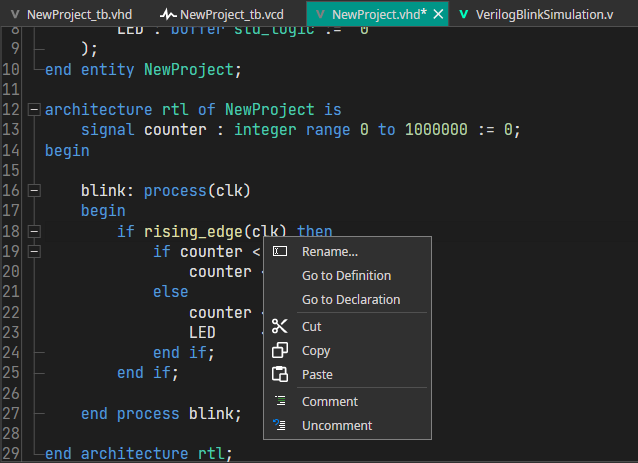
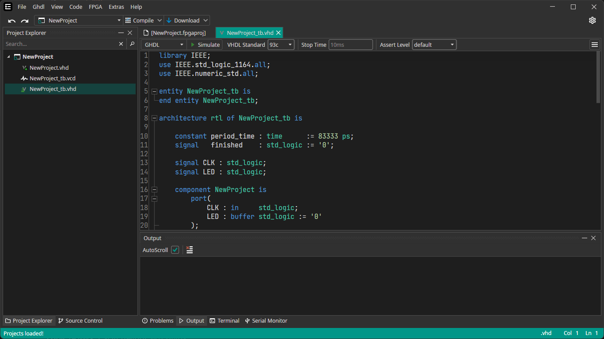
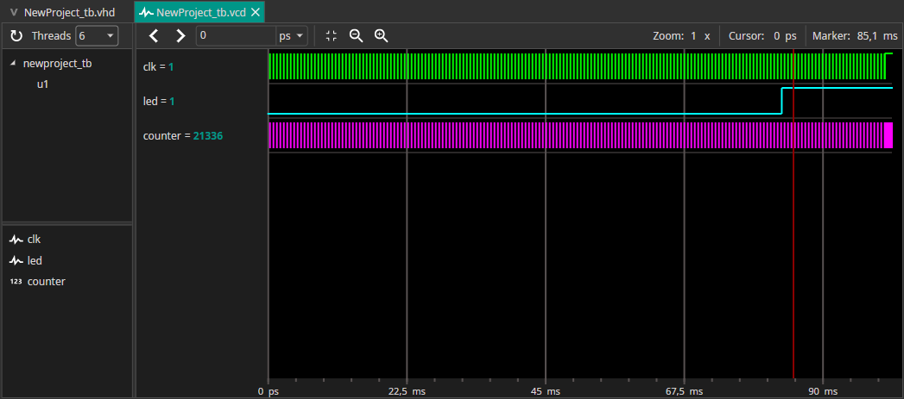
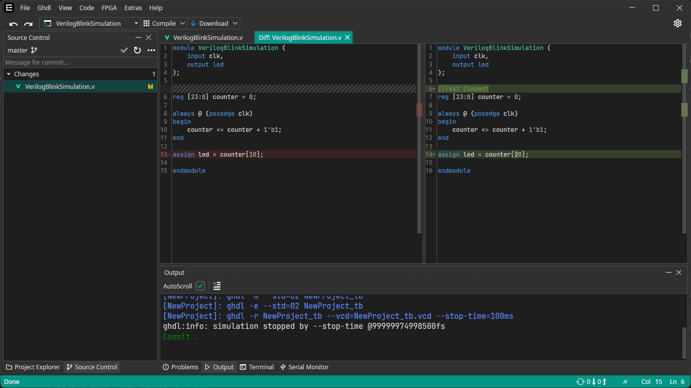
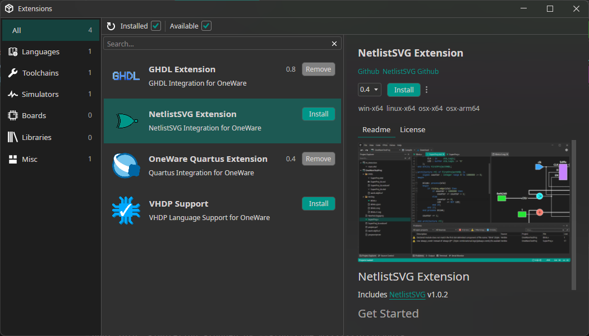

## Preview Release

A Preview for OneWare Studio is released and can be [tested](/docs/studio/setup) for Windows, MacOS and Linux as of now. 
OneWare Studio is all about extensibility and its feature will be gradually extended over time.

Feel free to provide feedback to us at [GitHub](https://github.com/one-ware/OneWare) or at <a href="mailto:info@one-ware.com">info@one-ware.com</a>

## Current Features

The Preview of OneWare Studio offers a lot of useful features to start programming FPGAs.
**VHDL** aswell as **Verilog** / **SystemVerilog** are supported out of the box.

### Code Editor

The OneWare Studio Code Editor integrates the [LSP Protocoll](https://microsoft.github.io/language-server-protocol/) and can therefore be used with already available Language servers like [Rust HDL](https://github.com/VHDL-LS/rust_hdl) for VHDL and [Verible](https://github.com/chipsalliance/verible) for Verilog/SystemVerilog.

These servers can offer a wide range of features, a few of them are:
- Real time Error Checking / Linting
- Completion
- Usage Search
- Go To Implementation/Declaration
- Renaming of Symbols



### Project System

OneWare Studio features a project system that is simple and no more limited to any choice of tools. This means that extensions can add their own properties.

Project files feature the `.fpaproj` extension and can look this way:
```json
{
  "Include": [
    "*.vhd",
    "*.vhdl",
    "*.v",
    "*.vcd"
  ],
  "Exclude": [
    "build"
  ],
  "Toolchain": "Quartus",
  "Loader": "Quartus",
  "TopEntity": "NewProject.vhd",
  "TestBenches": [
    "NewProject_tb.vhd"
  ],
  "Fpga": "Core MAX10"
}
```

As seen in this project file, Only VHDL, Verilog and VCD Files are visible in the Project Explorer. All other files will be hidden.
Also there are Properties that set the Toolchain and Loader to Quartus, aswell as defining a testbench `NewProject_tb.vhd`.

:::info
Currently, the TopEntity is a FileName. Toolchains assume, that the Top is named similar as the file without the extension.
In this example, the top for Toolchain operations would be `NewProject`.
This might be changed in the future, allowing for different top names than the top project file.
:::

### Testbenches

Speaking of testbenches, they can look like this:



Any compatible file can be marked as a testbench by simply right clicking the file in the Project Explorer and selecting `Mark as Testbench`.

In this example, GHDL is selected as the active simulator, allowing to set useful command line arguments directly inside the IDE Toolbar.
Other simulators can be easily added with extensions. Currently there is support for GHDL with using the `GHDL Extension` plugin. Also there is builtin support for Icarus Verilog after adding the [OSS CAD Suite](https://github.com/YosysHQ/oss-cad-suite-build) path to the settings.

Testbenches feature an configuration file aswell, using the same name as the testbench with an `.tbconf` extension that is hidden by default.
They are used to save values used by the Simulator and can look as simple as this:
```json
{
  "Simulator": "GHDL",
  "SimulationStopTime": "10ms"
}
```

Simulators can implement a Simulation that creates `.vcd` files, that will show the result of the simulation.

### VCD Viewer

Once the project is simulated, it is possible to view the `.vcd` Result directly inside the IDE.
GHDL and Icarus Verilog currently do this automatically after clicking on the `Run` button in their testbenches.
The VCD Viewer is highly optimized and can use **multiple threads** to load huge VCD Files extremely fast.
**It is also capable of showing simulation results in realtime while the Simulation is still running!**



The VCD Viewer features an configuration file aswell, using the same name as the vcd file with an `.vcdconf` extension that is hidden by default.
They are used to save settings for the view, such as which signals are currently open. A config file can look like this, saving the currently open IDs of signals:
```json
{
  "OpenIds": [
    "$",
    "%"
  ]
}
```

### Teamworking

Similar to VSCode, OneWare Studio integrates GIT to allow for easy teamworking.
Projects can be synchronized with GIT Providers, changes can be compared, comitted and merged.
All the features you would expect from a modern IDE, out of the box.



### Extensions

As already said, OneWare Studio focuses on extensibility. 
Plugins can be easily installed using the package manager and are capable of offering all kinds of new features.



As OneWare Studio uses .NET 8.0 and Avalonia, a template for generating UI Extensions can be found [here](https://github.com/one-ware/OneWare.Templates)
Precise documentation on how to create Extensions (Adding new FPGAs, Simulators, Toolchains and more) will be available soon!

## Roadmap

Features that we plan to include in the near future:

- Improve the Completion for HDL Languages
- Feature an Block Editor that can generate HDL files automatically
- Port the GDB Debugger from VHDPlus, allowing to Debug C++ Software
- Support for more Tools, Toolchains and Hardware out of the box

You are welcome to suggest more on [GitHub](https://github.com/one-ware/OneWare) or at <a href="mailto:info@one-ware.com">info@one-ware.com</a>!