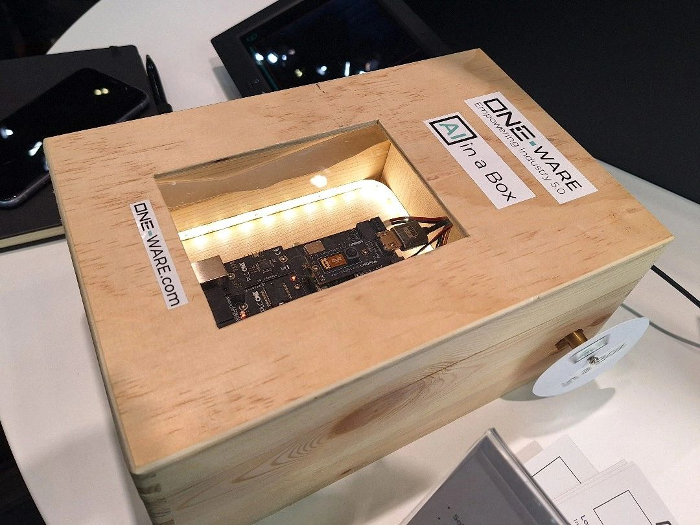

🌐 How can businesses stay ahead in the fast-paced world of AI and electronics development?  

The answer lies at the **embedded world Exhibition & Conference**, where the latest **technologies** are showcased, and innovative solutions emerge to tackle this challenge.

## Simplifying AI Integration for Industrial Applications  

🎯 To address the dynamic requirements of the **AI** and **electronics** industry, we are committed to our **mission** of making advanced AI integration more accessible for industrial applications.  

With our **AI generator**, we provide an innovative **solution** that enables efficient AI applications, even on the smallest **processors** and **FPGAs**. This initiative represents our dedication to the **democratization** of AI technologies—helping to accelerate AI adoption and enhance **efficiency** across industrial processes.

## Experience Our AI Demo at Embedded World  

👥 If you're interested in the **intersection of AI and industrial applications**, we warmly invite you to experience our **AI demo** firsthand.  

📍 Visit us at the **embedded world Exhibition & Conference** at the **Arrow Electronics booth** in **Hall 4A, Stand 342**.

Join us in shaping the future of AI-driven industrial transformation! 🚀  
