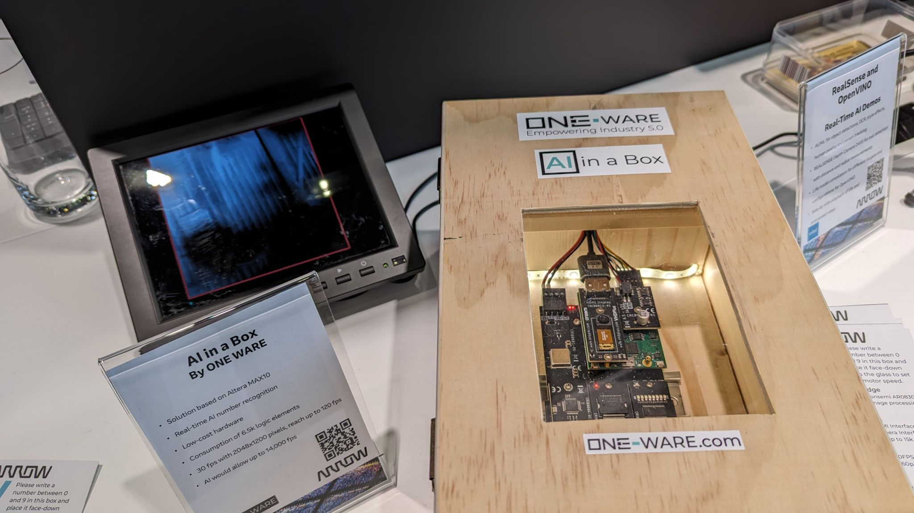
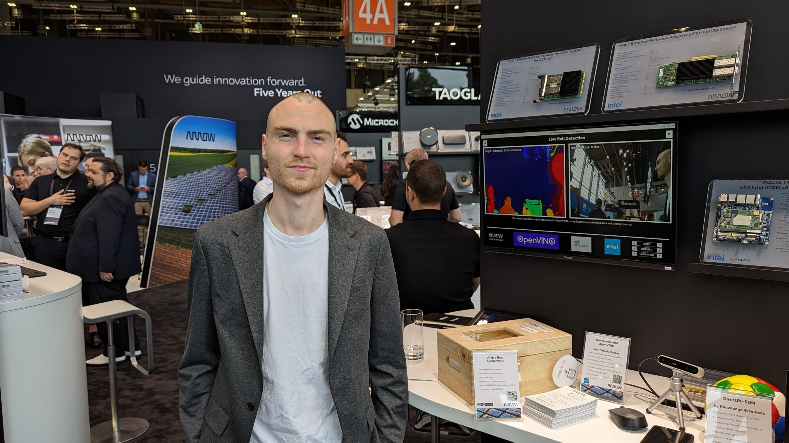

The **embedded world Exhibition & Conference 2024** provided us with an excellent platform to showcase our commitment to **AI** and demonstrate how our **AI-Generator** significantly improves the implementation of AI on **compact processors** and **FPGAs**.  

## A Valuable Experience for ONE WARE  

As an **AI startup**, it was particularly valuable for us not only to attend as visitors but also to **exhibit** at the **Arrow Electronics booth**. The sheer variety and number of **manufacturers** displaying their latest **innovations** were truly impressive.  

It was remarkable to see how numerous companies have embraced the **AI trend** and introduced **innovative solutions**, primarily utilizing **standard AI networks**. In contrast, our **Custom AI Networks**, due to their unique **adaptability** and **performance**, garnered significant **interest and recognition**. This highlights the growing demand for **tailored AI solutions** in an industry that increasingly seeks **differentiation and application-specific optimizations**.  

## Showcasing “AI in a Box”  

One of the major highlights of our participation was our **“AI in a Box” demonstrator**, which implements **Edge AI** on the **Altera MAX 10 FPGA**.  

👀 Visitors could experience firsthand how our technology **recognizes a handwritten number** and **controls motor speed in real-time** – all powered by an **energy-efficient and cost-effective FPGA**.  

This **interactive experience** seamlessly led to in-depth discussions with **industry peers** and **interested parties** about the **potential of Industrial AI**. These conversations clearly showed that the demand for **flexible and scalable AI technology** is greater than ever.  

## Industry Recognition & Future Prospects  

The visit from **Sandra Rivera, CEO of Altera**, further underscores the **growing relevance** and **enormous potential** of **industrial AI solutions**, confirming the **increasing importance of innovation** in this rapidly advancing sector.  

🎯 **Special thanks** go to the entire **Arrow Electronics team**, whose dedicated support enabled us to effectively present our technology.  

We look forward to leveraging the insights gained to further refine our products and meet the **challenges of the future** with **innovative AI solutions**. 🚀  

#EmbeddedWorld2024 #EdgeAI #FPGA #IndustrialAI #TechStartup #Innovation  
