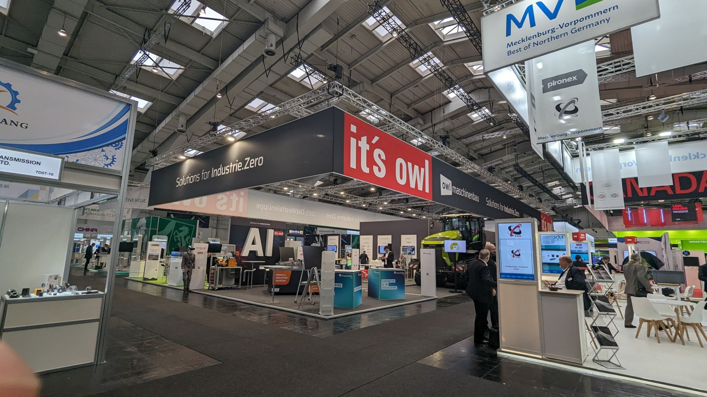

# ONE WARE at HANNOVER MESSE 2024  

## Representing the OWL Community at the Heart of Innovation  

Last week, we had the privilege of representing **ONE WARE** at the **OWL Community Booth** at **HANNOVER MESSE**, alongside **34 leading companies, research institutions, and startups**.  

Organized by **OstWestfalenLippe GmbH**, **owl maschinenbau e. V.**, and **it's OWL**, this booth was dedicated to the visionary theme of **Industrie.Zero**—a groundbreaking initiative focused on making industrial production both **sustainable** and **intelligent**, paving the way for the future of global manufacturing.  

At the heart of this transformation are **Artificial Intelligence** and **Sustainability**—key forces driving innovation and progress.  

## Advancing AI for Sustainable Manufacturing  

At **ONE WARE**, we are at the forefront of these advancements with our **AI Generator**, which was showcased as part of our **“AI in a Box” demonstrator** at the **embedded world Exhibition & Conference**.  

🚀 **Key Highlights:**  
✅ **15,000 images processed per second**  
✅ **Ultra-low energy consumption of just 0.3 watts**  
✅ **Real-time, energy-efficient control on compact processors & FPGAs**  

This technology represents a significant leap forward in **industrial automation**, proving that **AI** can be both **high-performance** and **energy-efficient**, aligning seamlessly with the objectives of **Industrie.Zero** and promoting **sustainable production methods**.  

## Recognition and Growing Demand for AI Solutions  

A standout feature of our innovation is our **custom-developed AI network**, renowned for its **adaptability** and **high performance**.  

Following its strong reception at **embedded world**, we were honored to see it receive **further recognition and interest** at **HANNOVER MESSE**. The overwhelming positive feedback from key figures in **politics and industry** underscores the growing demand for **scalable AI solutions** tailored specifically for industrial applications.  

## Driving the Industry Towards a Sustainable Future  

We are **proud** to be part of the dynamic and future-oriented **OWL community**, working together to drive industrial **sustainability** and **innovation** forward.  

HANNOVER MESSE 2024 was more than just an event—it was a testament to how AI can revolutionize the way we think about manufacturing and industrial automation.  

🔎 **Stay tuned for more exciting developments as we continue to push the boundaries of AI for a more sustainable future!**  

  

