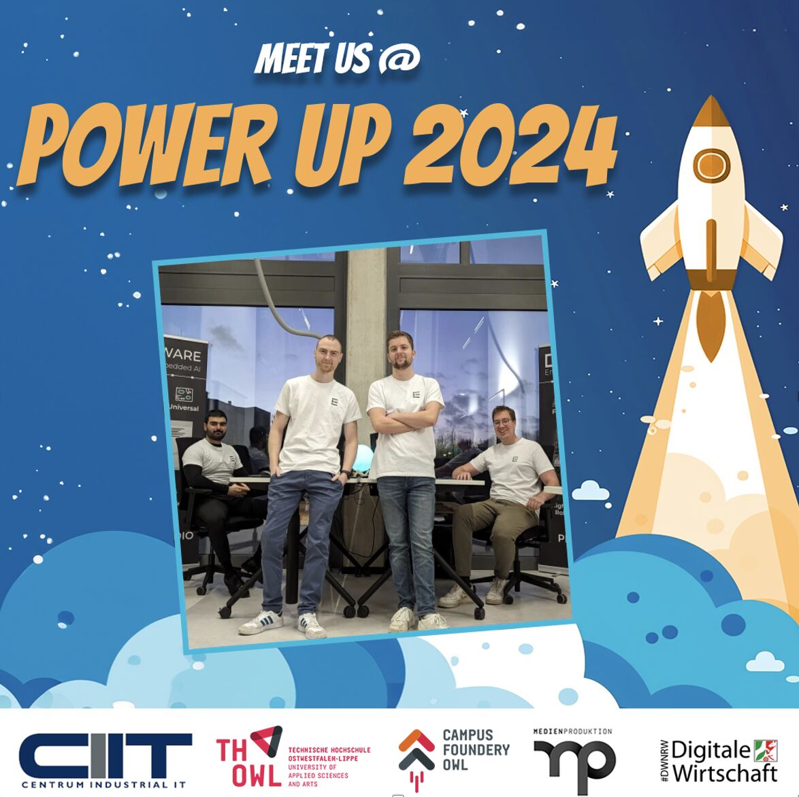

After our successful appearances at the **embedded world Exhibition & Conference** and most recently at **HANNOVER MESSE**, we are excited to keep the momentum going and participate in the **Power Up Expo**!  

## What is Power Up Expo?  

📍 **Date:** May 8, 2024  
📍 **Location:** Innovation Campus Lemgo  
📍 **Organized by:** CENTRUM INDUSTRIAL IT (CIIT) e. V. in collaboration with Campus Foundery OWL  

The **Power Up Expo** is a leading event that brings together **over 30 startups** and numerous **industry leaders** from key sectors, including:  

✅ **Industrial Automation**  
✅ **Artificial Intelligence**  
✅ **Smart Work**  
✅ **New Beverage**  
✅ **Social Entrepreneurship**  

This impressive lineup underscores the **significance and impact** of the event, offering not only a **platform to explore the latest innovations** but also a unique **opportunity for networking and building strategic collaborations**.  

With a **strong focus on entrepreneurship, digitalization, and automation**, the expo serves as a **catalyst for driving growth and progress** in these critical areas.  

## ONE WARE at Power Up Expo  

For **ONE WARE**, this event presents an **excellent opportunity** to showcase our **AI solutions** to a highly engaged audience.  

🎯 **What We Aim to Achieve:**  
🔹 Gather **direct feedback** on our technologies  
🔹 Gain **valuable insights** into user needs  
🔹 Expand our **network** within the industry  
🔹 Strengthen our **visibility** in the innovation ecosystem  

With support from the **Ministry of Economic Affairs, Industry, Climate Action, and Energy of North Rhine-Westphalia**, and a **strong emphasis on technology and innovation** in the **OWL region**, this expo is a key event for us to **connect, learn, and grow**.  

🚀 **We look forward to meeting you at Power Up Expo 2024 and shaping the future of AI-driven industrial solutions together!**  