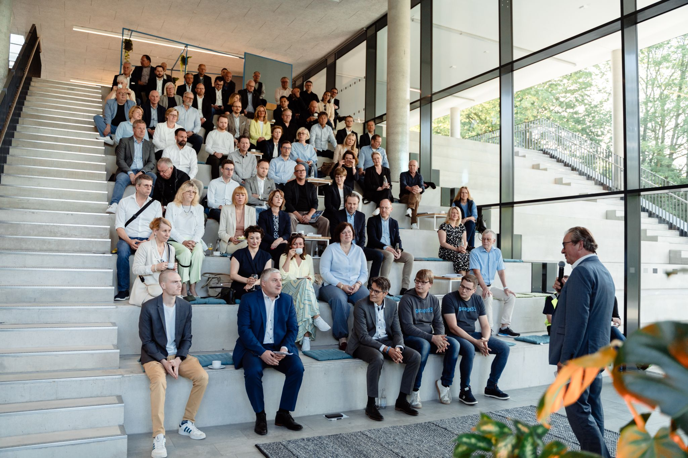

# Business Breakfast at Startup Campus OWL ☕  

We had the privilege of participating in the **Business Breakfast** organized by **Wirtschaftsförderung Paderborn**, bringing together numerous **entrepreneurs** from diverse industries.  

The newly established **Startup Campus OWL**, powered by **garage33**, has quickly become a key **hub for innovation and entrepreneurship**. The **network** being created there is truly impressive, and the **future plans** for the campus sound extremely promising.  

## Showcasing AI Innovation  

🎤 Alongside the team from **PALPRINT GbR**, **Leo** introduced the diverse applications of our **AI software, ONE WARE Studio**, in his pitch.  

✅ **Key Takeaways:**  
✔️ **Positive and motivating feedback** from attending entrepreneurs  
✔️ **Engaging discussions** on AI-driven solutions  
✔️ **Exciting new connections** through valuable networking  

## A Thriving Startup Ecosystem  

The **networking sessions** after the pitches provided an excellent opportunity to exchange ideas, discuss industry challenges, and establish **valuable new contacts**.  

A **big thank you** to **Wirtschaftsförderung Paderborn** and **garage33** for the **excellent organization**! 🎉  

🚀 We are already looking forward to the next event in **June at "Meets the Start-ups"**!  