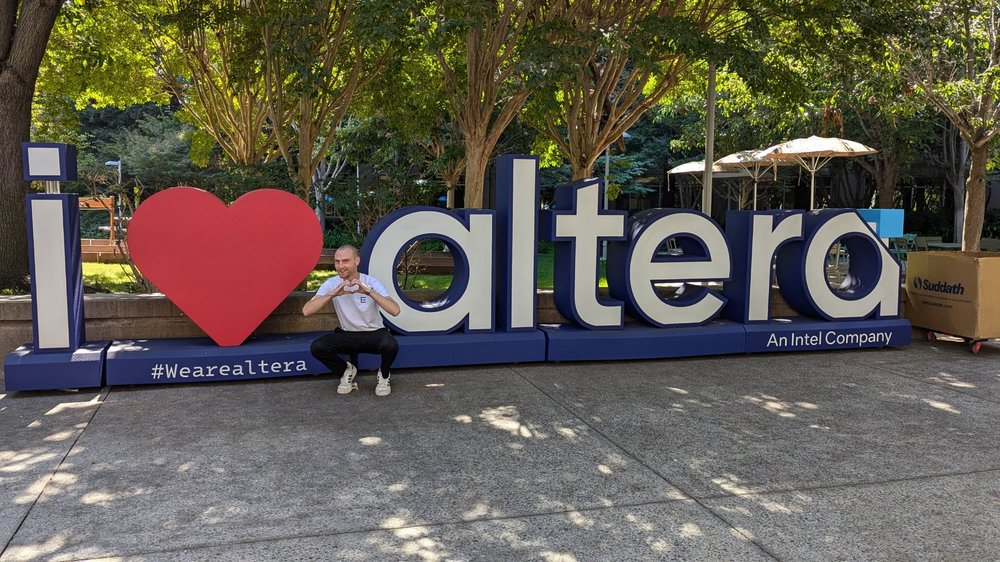

# 🚀 An Inspiring Day at Altera Innovators Day in San José!  

Yesterday, we had the privilege of participating in **Altera Innovators Day**, and we were truly impressed by the **groundbreaking innovations** showcased—especially the **Agilex 3 series**.  

The **potential of this platform** for our own **Edge AI** solutions is enormous, unlocking **exciting new possibilities** for advancing our **AI technologies**.  

## Showcasing ‘AI in the Box’ & Engaging Discussions  

🎤 The event was rich in **insights and innovation**, providing us with a **unique opportunity** to present our **‘AI in the Box’ demo** to an engaged audience.  

✅ **Key Highlights:**  
✔️ Showcased our **Edge AI innovations**  
✔️ Explored **new technological advancements**  
✔️ Engaged in **deep discussions** with partners & industry experts  

The **exchange with fellow participants and partners** was especially valuable, fostering **forward-looking discussions** about the future of **AI** and its role in **next-generation Edge computing**.  

## Looking Ahead  

🔹 We sincerely **thank the Altera team** for the **excellent organization** and the opportunity to be part of such a meaningful event.  

💡 Experiences like these **reinforce our mission** to **push the boundaries of AI technology**, shaping the future of **industrial AI and Edge computing**.  

🚀 The journey continues—stay tuned for more exciting developments! 
