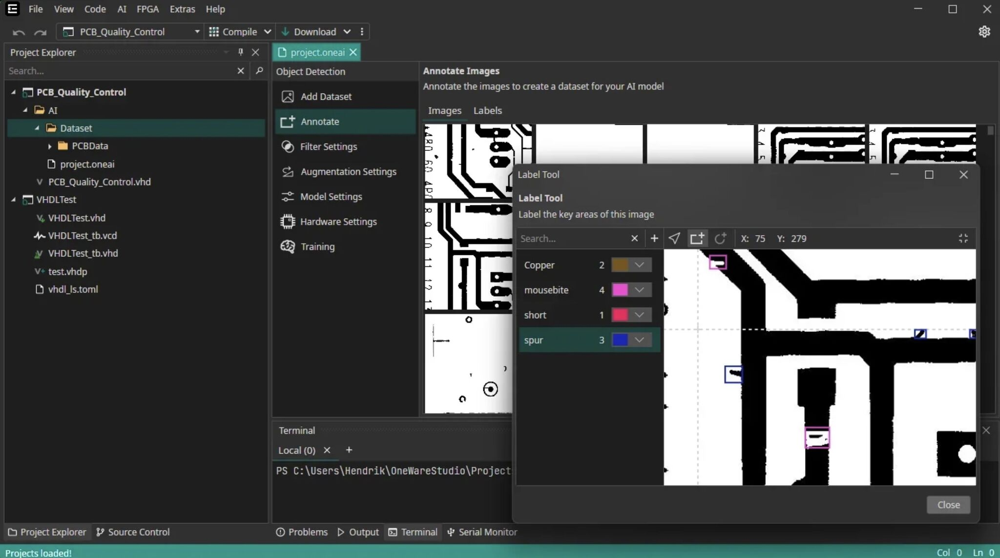

Access the recording of our recent webinar, created in collaboration with **Arrow Electronics** and **Altera**. Discover how to seamlessly integrate AI into FPGAs to develop powerful and customized applications.

## What to Expect?

- **Insights into the Latest Developments:** Learn about the most recent advancements and best practices in FPGA-based AI.
- **Step-by-Step Guidance:** Explore how to leverage our #OpenSource **ONE AI libraries** to fully utilize FPGA computational power.
- **Live Demonstrations:** Watch how #TensorFlow models are efficiently transformed into highly parallel #VHDL implementations for FPGAs.
- **Practical Application:** Learn to program the **MAX10** with our user-friendly **ONE WARE Studio** platform and see how AI architectures are automatically optimized for the hardware.

🔗 [Register now for free](https://shorturl.at/Qgxki) and get instant access to the webinar recording!
