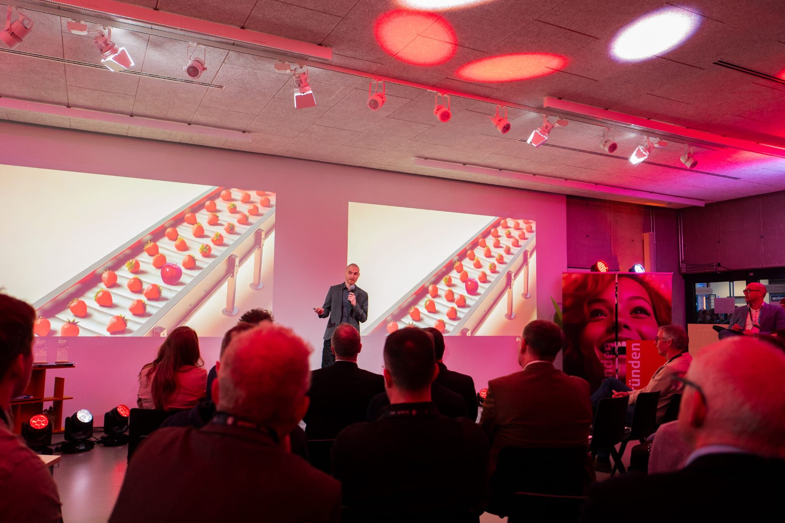

# "Moonshots & Moneten" Recap 🚀🌟

On February 12th, our team had the honor of presenting our advanced, customized **AI** solutions on the **OWLStartupPitch** stage in **Paderborn**. With over 500 guests and numerous innovative **startups**, the day was filled with opportunities for inspiring **keynotes** and **discussions**.

This event was a significant **milestone** for us as we had the chance to share our **vision** in-depth and gain fresh perspectives. The positive feedback and interest in **collaborations** that we received reinforce our leading role in **industrialautomation** and the development of adaptive AI **solutions**.

Special thanks go to the garage33 team for a well-organized event. We look forward to continuing the collaborations initiated and are excited about future events.