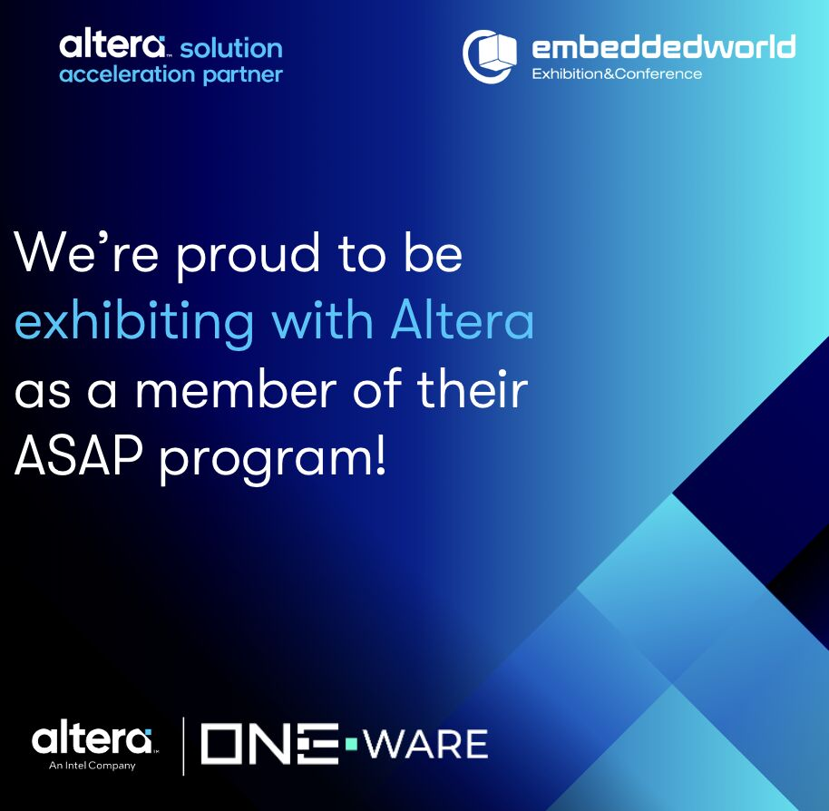

# Official Countdown: 11 More Days Until #EmbeddedWorld in Nürnberg!

We’re proud to be exhibiting with **Altera** as a member of their **Altera Solution Acceleration Partner (ASAP) program**! Come by Altera’s booth (5-343) and experience our "AI: Low Power Quality Inspection" live and see our AI Generator **ONE AI** in-action featuring the latest #Altera MAX® 10 #FPGA. Our expert **Leo Wiegand** will be in person at the event, speaking to attendees and answering questions!

👉 **See a preview of our demo on Altera’s new website:** [Click Here](https://lnkd.in/e8XTUAhZ)
