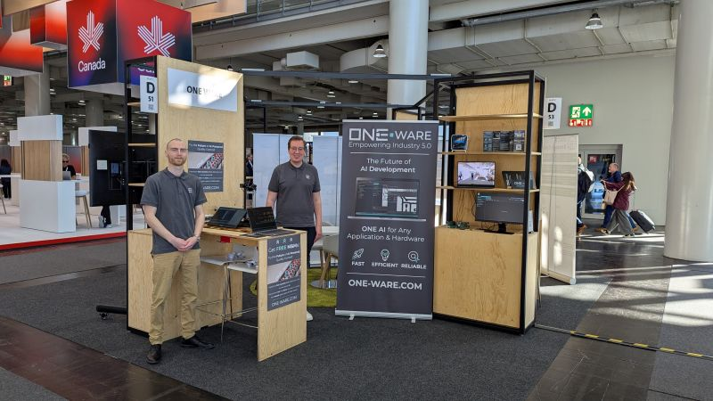

# 🚀 From Nuremberg straight to Hannover!

After embedded world Exhibition&Conference our exhibition journey continues: ONE WARE is live at HANNOVER MESSE – Startup Area | Hall 2, Booth D51 – from March 31 to April 4.

Experience our powerful new #demo and see what ONE AI is capable of:
🔍 It automatically generates #neural #networks tailored to your #application, target #hardware and #data.
⚡️ The result? Up to 99% lower energy consumption compared to conventional solutions – and seamless integration without complexity.
🧠 Models run not only on modern #industrial PCs but even on 10-year-old #chips and low-power #microcontrollers.

🌍 No other system #worldwide offers this level of #flexibility, #speed and #precision.  ONE AI is built to become the universal #AI – for any #application on any #hardware in any #market. Scalable across industries: from #manufacturing to #aerospace to #medical tech.

👉 Visit us at our booth and meet our experts Leon Beier and Leo Wiegand in person – we’re excited to show you what’s possible!
