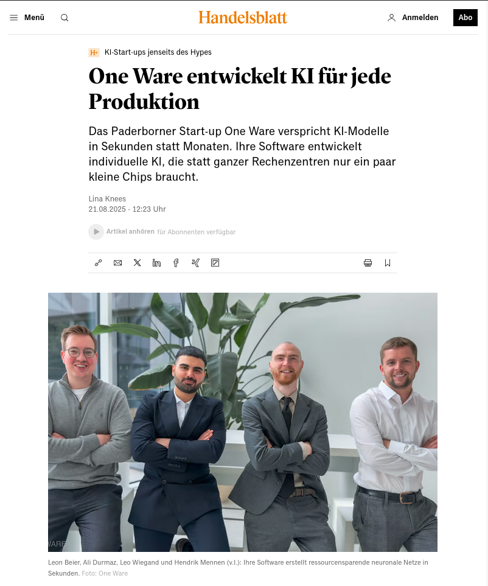

# ONE WARE in Handelsblatt 🎉

**Handelsblatt** has launched a brand-new series, *“AI Startups Beyond the Hype.”*  
In this handpicked selection, only **eight European companies** with true **technological depth** are featured. And **ONE WARE** is one of them.

<!-- truncate -->

## Why this matters
For us, this is a strong signal: **visibility where it matters** — with decision-makers who expect **productive deployment** and measurable outcomes.  

Our inclusion confirms our focus on **industrial impact** and reflects exactly what ONE WARE stands for:

> **Make tailored AI radically faster, simpler, and more accessible.  
> For any task, hardware, and industry.  
> Enabling anyone to build tailored AI in seconds.**

## Industrial impact at scale
This is how companies across industries can equip their **production with AI** in a short time.  

Because our models run productively on the **smallest chips** and **low-power hardware**, we are **democratizing AI at industrial scale**.

## Perfect timing
Starting **September 1**, we will open **ONE AI** to all interested users and developers.  

- Free registration, instant training of your own AI models  
- Guided workflow with sensible defaults — productive from day one  
- Broad hardware compatibility: **CPU, GPU, microcontrollers, and FPGAs**  
- Exported models testable on different target systems with a **30-day license**

Decision-makers can provide **ONE AI** directly to their developer teams.  
Developers can **start for free from September 1**.

👉 [Join the waitlist now](https://forms.office.com/pages/responsepage.aspx?id=i920S-FVZEWRotr4Gjl24qtEGuoJgoJEmSnjTcpkTZpUNTJJWEY4S0g1VUdFWVVQMERBTEg5U01DQS4u&route=shorturl) to be ready on launch day.

## Gratitude
A big thank you to **Handelsblatt** for selecting **ONE WARE** as one of only eight European deep-tech teams in *“AI Startups Beyond the Hype.”*  

And thanks to **Lina Sophie Knees** for the article.  
