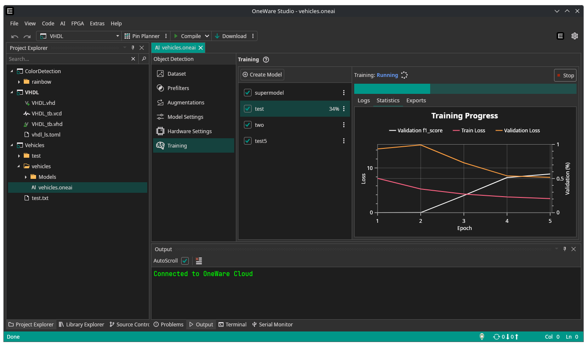

After months of hard work, we are excited to finally release **OneAI** for everyone!

<!-- truncate -->

The **OneAI Extension** makes creating AI models **ultra-fast**—and just as **easy**.  
You don’t need any AI expertise to get started.  

Integrated into **OneWare Studio**, it runs as a **cross-platform desktop app** that adapts to **any task, hardware, or market**.  

Every model is automatically **optimized** to run on the **smallest chips** with the **lowest power consumption**, so you can bring powerful intelligence to edge devices in no time.  

## Get Started Now and Claim Free Credits

Start training your own models right away!  
Simply [sign up](https://cloud.one-ware.com/Account/Register), confirm your email address, and begin building with **€500 in free credits**.

For more details, check out our [Getting Started Guide](/docs/one-ai/getting-started).

