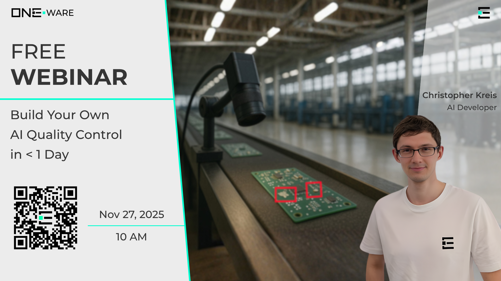

# Free Webinar: Build Your Own AI Quality Control in < 1 Day

AI for quality control sounds far too complex?  
We’ll show you how simple Vision AI can be today.

[Sign up now!](https://short.one-ware.com/webinar)

<!-- truncate -->

Join our **Free Webinar** on **November 27, 2025 at 10 AM (CET)** and learn how to build a complete Vision AI quality control workflow — in less than a day.

During the session, you'll discover how to:

- understand what **ONE AI** is and how it helps you train production-ready AI models in minutes  
- create a proper dataset for real-world quality control  
- apply expert tips & tricks to get the **best performing AI model**  
- build a complete **demo project** with only ~15 images  

## Prepare in Advance (Optional)

Want to get a head start?  
Download our **open-source IDE**, **ONE WARE Studio**, including the **ONE AI extension**, and prepare your own Vision AI model before the webinar:

👉 https://one-ware.com/docs/get-started/installation/

Or explore our hands-on tutorials to see how easy it is to create your first AI model:

👉 https://one-ware.com/docs/tutorials/overview

## Register for Free

Secure your seat and learn how Vision AI can transform your quality control pipeline:

👉 https://short.one-ware.com/webinar
