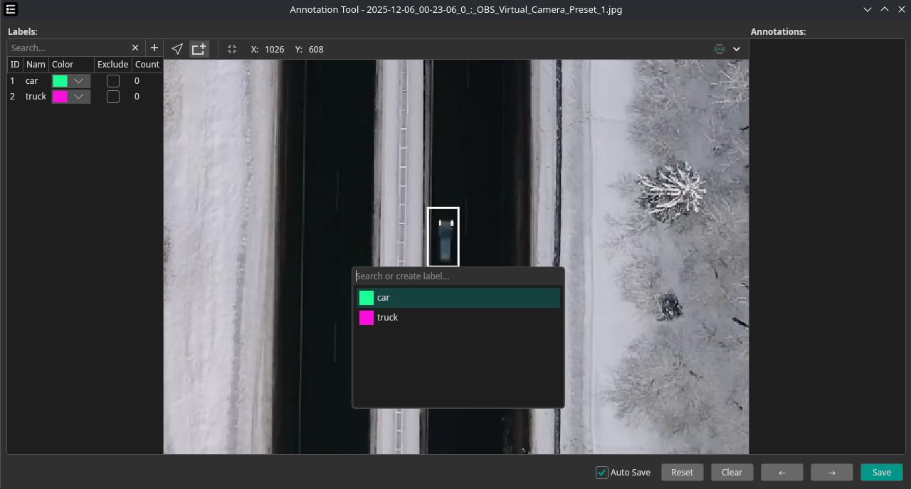
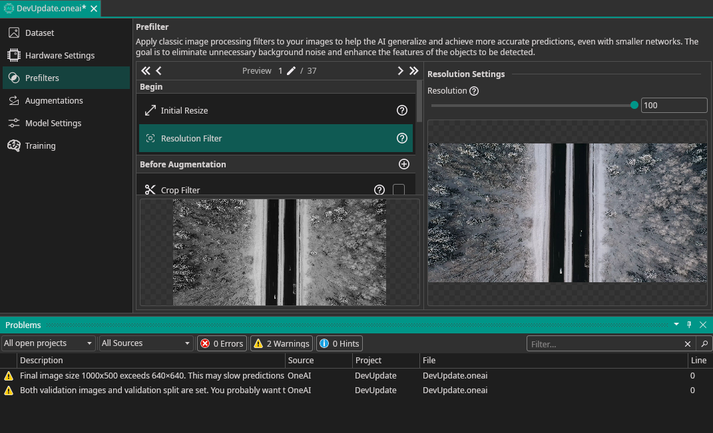
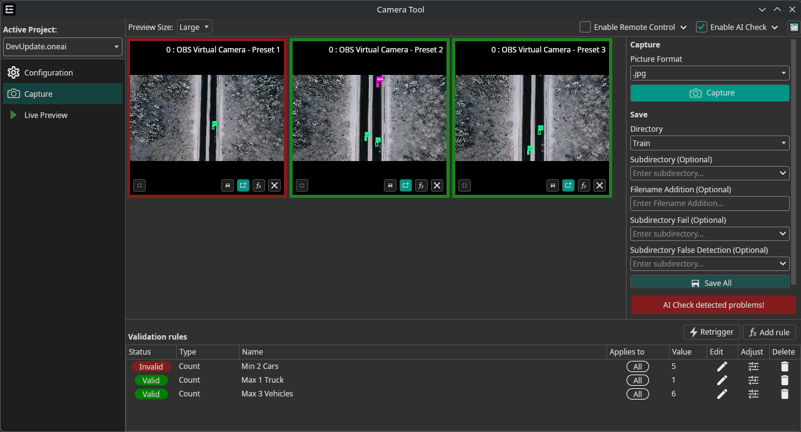
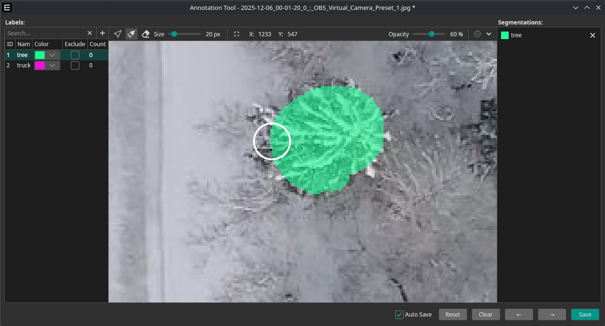

Greetings and welcome to the first of many upcoming dev updates, where I show some of the features that we have been working on lately and the exciting features that will be **released next Friday**.

<video autoPlay loop muted playsInline style={{ maxWidth: '100%', height: 'auto', display: 'block', margin: '0 auto', marginBottom: '5px' }}>
  <source src={require('./img/drive.webm').default} type="video/webm" />
</video>

**This demo was trained using just 25 frames from a [video](https://www.pexels.com/video/aerial-shot-of-the-road-in-the-middle-of-the-forest-during-winter-6640865/), extracted with our [camera tool](/docs/one-ai/getting-started/dataset/camera-tool/).**

<!-- truncate -->

## Annotation Tool Changes

To boost efficiency, we added some shortcuts to make manual labeling much faster. It is now also possible to select or create labels on the go—much faster than before.

You can use the following hotkeys now:

**→ Key**: Next Picture 
**← Key**: Previous Picture 
**↓ Key**: Next Label 
**↑ Key**: Previous Label 
**R Key**: Rectangle Tool 
**C Key**: Cursor (Selection Mode)

## GPU-Accelerated Prefilters

Having fast and accurate prefilters is one of our biggest priorities. Before, we were struggling with performance, which is why we always applied the prefilters to the reduced preview size. This worked quite well but had some accuracy issues, since an accurate preview needs to be applied for the full scaled image.

With update 0.8.0, we have a new system in place, swapping out the CPU filters with fancy GPU-rendered ones! This allows us to apply the filters with full accuracy while keeping great performance.

<video autoPlay loop muted playsInline style={{ maxWidth: '100%', height: 'auto', display: 'block', margin: '0 auto', marginBottom: '5px' }}>
  <source src={require('./img/prefilters.webm').default} type="video/webm" />
</video>

**This is an 8K image applying filters in real time 🔥**

## Warnings and Recommendations

Since OneWare Studio is an IDE, we have options to show warnings and errors in real time.  
We want to use that system for OneAI too, starting with a few simple warnings to help users get started.

This system will be massively improved in the coming weeks, giving you real-time assistance and recommendations on how to improve your AI.

## Rule-Based Camera AI Check

We reworked the AI Check in the Camera Tool, allowing for more flexibility. It is now possible to add rules to validate each capture. As of now, you can automatically check for the following:

- **Count**: Define min/max count of objects  
- **Area**: Define min/max area (in pixels) for detections  
- **Weighted Count**: Same as Count but more advanced, allowing weights for each detection  
- **Weighted Area**: Same as Area but more advanced, allowing weights for each detection  
- **Min-Distance**: Ensures a minimum distance between detections  

The **remote-control** makes it possible to easily implement an automatic AI Check and even control external hardware directly from our software. 

:::note
If you are interested in this, need additional features, or would like to have a version that runs independently from OneWare Studio for production use, please write us at <a href="mailto:info@one-ware.com">info@one-ware.com</a>.
:::

## New Training Statistics

We replaced the old plotting library with a fancy new one—check it out:

## Conclusion and next steps

That concludes the biggest recent changes, but there is a lot more. We listened to the feedback from the hackathons and implemented lots of small improvements and bug fixes that enhance the overall experience.
The next update will also finally include proper [Code Signing on MacOS](https://github.com/one-ware/OneWare/issues/62) — sorry for the long delay. Thank you so much to the community for all your feedback and suggestions.

Stay tuned for another post next weekend, where I showcase the new segmentation annotations, allowing for more complex shapes.

