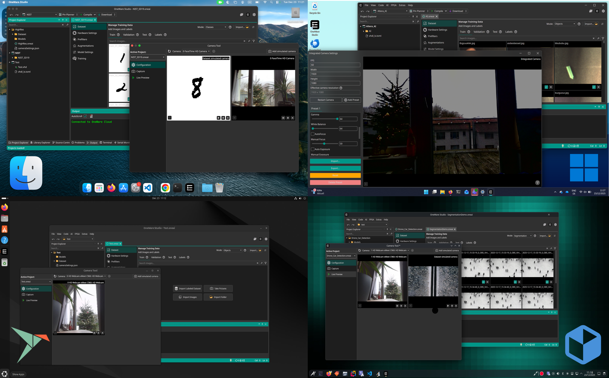
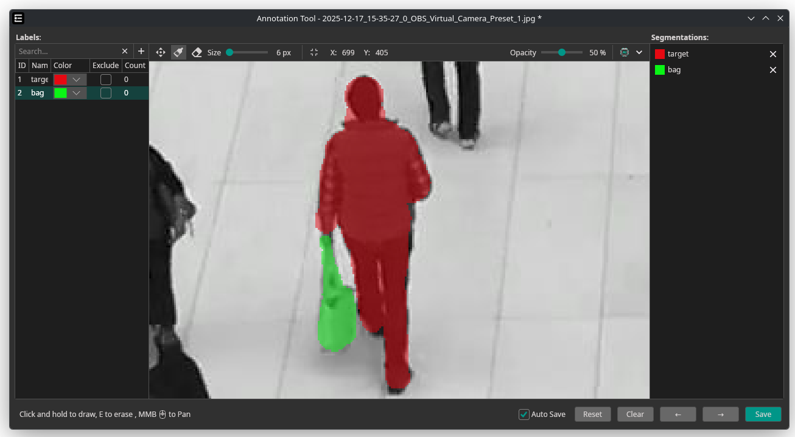
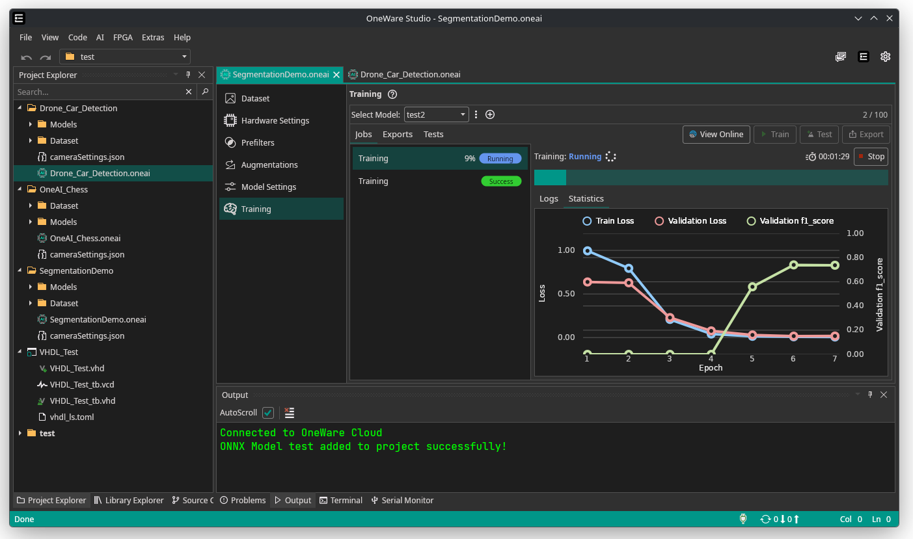

Welcome to the last Dev Update of this year, where I'll show you some of the features we've been working on this December!

All of these features are now released with the recent OneWare Studio and OneAI Extension (0.9) updates.

**If you haven't already, it's time to update!**

**Our Camera Tool is now available out of the box on Windows, MacOS, Linux (Snap & Flathub)**

<!-- truncate -->

## Camera Tool

After fighting macOS hardened runtime as well as dependency hell on Linux, the Camera tool is finally working on all our supported platforms! Our macOS App is also now properly code signed, so no workaround is needed anymore.

**The Camera Tool allows you to create your own dataset, test your trained models, and even build a quality control system directly in OneWare Studio.**

- Support for multiple cameras and presets simultaneously  
- Quick and convenient dataset creation  
- Real-time testing of trained models  
- Real-time Ai-Quality Control with remote control

**[Try it out now!](/docs/get-started/installation)**

## Segmentation & Annotation Tool Changes

For many use cases, rectangle annotations are not sufficient. For these cases, you can now use segmentation annotations.

**Segmentation is now available, allowing to detect objects on a per-pixel basis 🔥**

Live preview and import tool support for this mode are coming in January.

:::warning Annotation Control Change
As you may have noticed, we changed the panning button from right click to middle mouse button.
This matches other tools. We added control hints in the bottom left corner.
:::

## New Training Overview

**Similar to the cloud, you can now view recent training jobs for a better overview**

## Feedback

We got a lot of valuable feedback from the community. Please continue to do so!
Use the feedback tools available in OneWare Studio or write us at <a href="mailto:feedback@one-ware.com">feedback@one-ware.com</a>
## Road to 1.0

With these changes done, we are inching closer to 1.0, which we expect to release in Q1 of 2026.

Stay tuned for more updates in January.
**Merry Christmas and Happy New Year to everyone!** 🎆