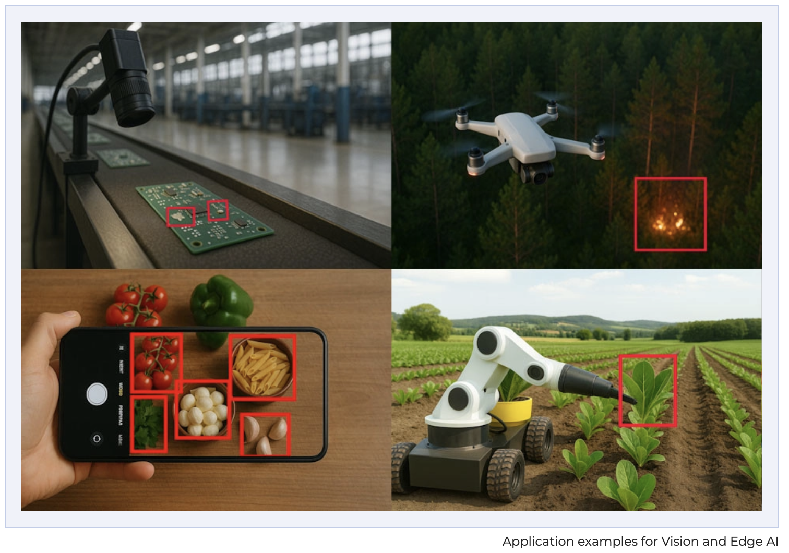
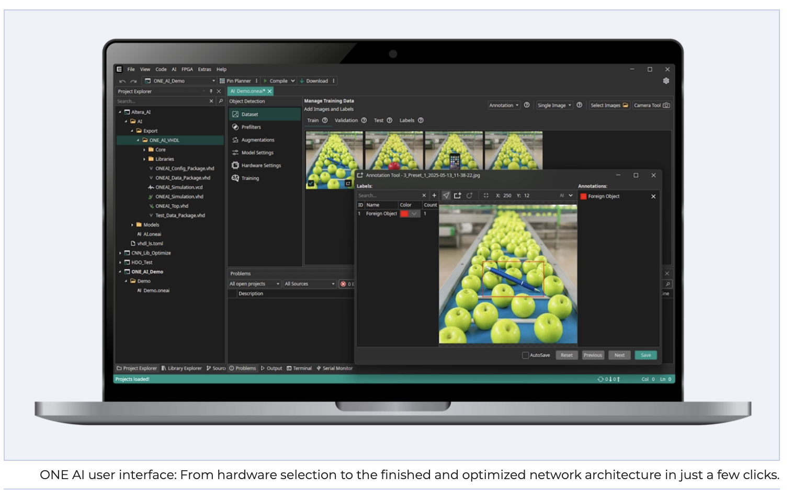

AI and especially Vision AI is no longer just a trend. But it’s not only about chatbots but especially about those application-specific AI solutions that are embedded in today’s machines, products, and technology. Because even though large companies compete with ever larger AI models, anyone who wants truly precise, fast, and above all energy-efficient AI needs AI that is tailored to the specific application.

However, optimizing AI for special applications is complex and requires not only AI expertise but also integration specialists. Current software providers claim to enable AI implementation quickly and without much expertise, but the pre-built AI models they offer cannot possibly cover the countless combinations of applications and hardware that exist in reality.

<!-- truncate -->

## The efficiency dilemma of AI: Quality, time & cost

This reality leads to a clear trade-off. The longer an AI is optimized and the more it is customized, the closer it gets to the maximum potential hidden in the dataset. The problem: this increases the demands on the team’s talent, and both project timelines and costs grow immensely. The result is the same in many companies: they end up with inefficient AI models that require too many resources while delivering worse results. The reason: either the right developers with a deep understanding of AI architecture and optimization are missing, or the company simply cannot afford the development costs.

## ONE WARE wants to resolve this conflict with ONE AI

The company ONE WARE resolves this optimization conflict with a novel and patent-pending software called ONE AI. ONE AI is the world’s only platform that fully automates the generation of custom neural network architectures, individually tailored to the respective application, data, and target hardware.

ONE AI automates the entire AI development process in three steps. First, ONE AI analyzes the dataset along with the application context and the specifications for desired hardware and target performance. In the second step, ONE AI uses its knowledge from current AI research and its own experience in architecture optimization to predict the required characteristics of the target architecture in just one step. In the third step, the suitable AI architecture is automatically assembled from these predicted properties. This entire process takes only 0.7 seconds. Because ONE AI can simultaneously take into account insights from numerous previous research results, the resulting models are often already better than what has previously been achieved after months of manual experimentation and optimization.

The approach of ONE WARE aims to make the entire AI development up to actual integration simpler and more efficient. Thanks to its intuitive user interface and suitable tutorials, AI development can also be used by people without AI knowledge. After the automatic architecture prediction, the model can be trained and exported optimized for any target hardware. To ensure that the generated models can be deployed on the respective hardware, ONE WARE Studio is available as an open-source development environment. This creates a complete platform: ONE AI handles automated model generation and optimization, while ONE WARE Studio bridges to the target hardware and enables productive deployment.

## Practical example: Quality control of potato chips on Altera MAX10 FPGA

The difference between universal models and ONE AI in practice is demonstrated by an example from a joint whitepaper by ONE WARE and US chip manufacturer Altera. The application scenario is quality control for potato chips. In a reference project, a universal AI was trained that achieved 88 percent accuracy on test data. To inspect 24 chips per second, the latest AI hardware, an Nvidia Jetson Orin Nano, was required. This made the detection of defective chips not only unreliable but also resource-intensive and too slow for typical production throughputs.

By using ONE AI, the picture changes completely. The AI predicted in 0.7 seconds achieves 99.5 percent correctly detected defective chips and is 1400 times more efficient than the universal AI. The effect on hardware selection is immediate. Since the inspection speed of the AI far exceeds the production speed, specialized high-performance accelerators are no longer required. Instead, a ten-year-old and twenty times more energy-efficient Altera chip is sufficient to recognize 1700 chips per second. By using self-developed open-source libraries for universal AI export to FPGAs, latency was reduced by a factor of 488 compared to specialized AI hardware. This means that it is no longer primarily about having the “right” hardware with maximum computing power, but about having the right AI architecture. ONE AI thus enables highly performant AI models to be deployed even on over ten-year-old industrial hardware, immediately and without manual optimization or resource waste.

[test](img/potatochips.png)

## Fast and free replication

The example above can easily be replicated. On the ONE WARE website among other examples, the potato chip quality control project is available for download. There is also a detailed explanation of how to configure all settings correctly. This allows the first AIs to be trained with ONE AI in a very short time and completely free of charge.

## Economic efficiency of efficient AI with ONE AI

The approach of ONE WARE is also designed to lower economic barriers. Working with ONE AI is cost-efficient. With sufficient free credits for AI training, there are often no costs when using the software initially. Only when a company decides to actually deploy an AI and thus gain measurable value is a usage license required. This way, companies avoid high upfront investments, as are common in traditional, individual AI development.

## Conclusion and outlook

The vision of ONE WARE is clear: AI should increase productivity instead of wasting resources. And these resources include not only unnecessarily large and power-hungry hardware but also development time and costs. ONE AI lays the foundation for this by replacing iterative model trials with targeted architecture prediction, reducing development effort, and enabling reproducibly more precise results.

---

## Reference & Further Reading

This article was originally published as part of a featured report on **Elektor Magazine** — a leading international technical publication for electronics and embedded systems engineers, makers and industry professionals.

For more details and related insights on ONE AI for Vision- and Edge AI applications, see the original Elektor page:  
👉 https://www.elektormagazine.com/news/one-ai-vision-edge-ai-en#&gid=1&pid=3

Elektor is a respected technology magazine and online platform covering embedded systems, microcontrollers, industrial electronics, sensors, and AI-enabled applications. It publishes in-depth analysis, product reviews, and expert reports for design engineers and technical innovators.

