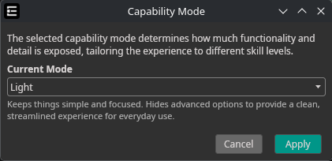
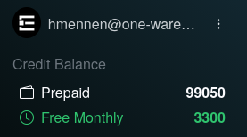
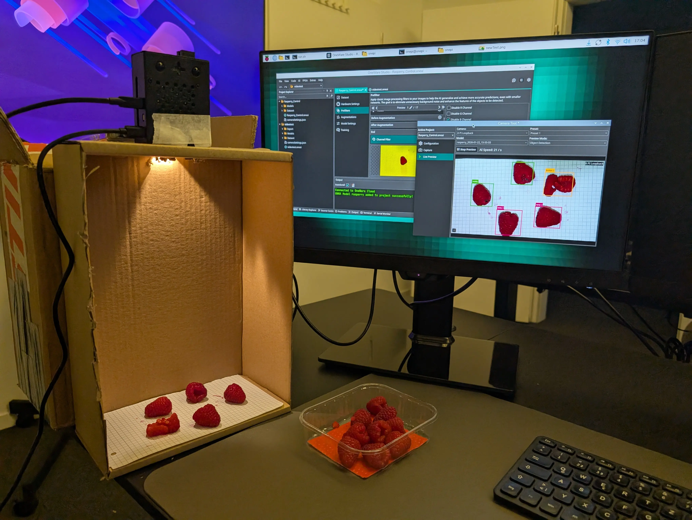
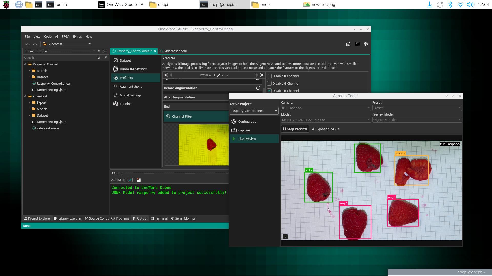
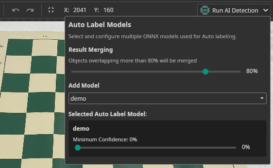
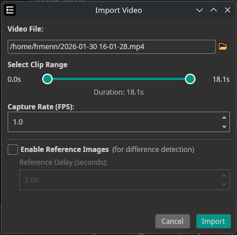
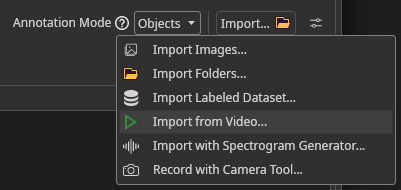
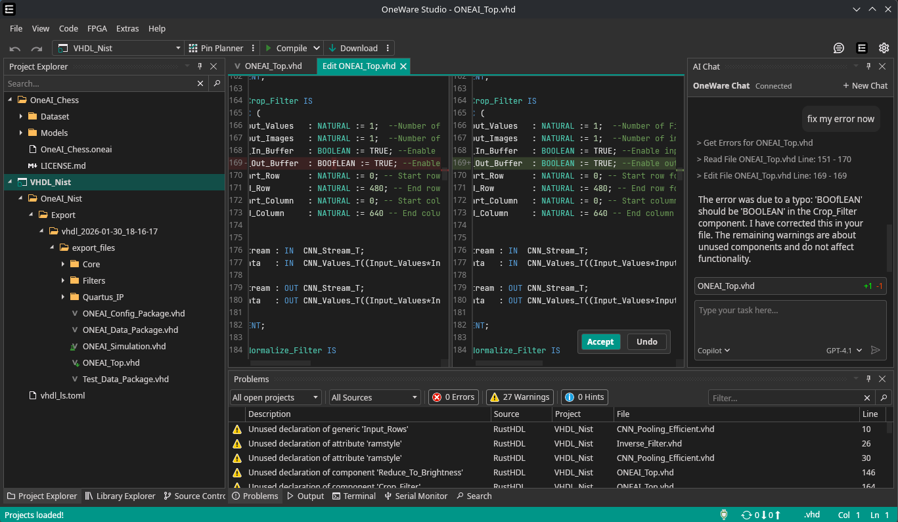
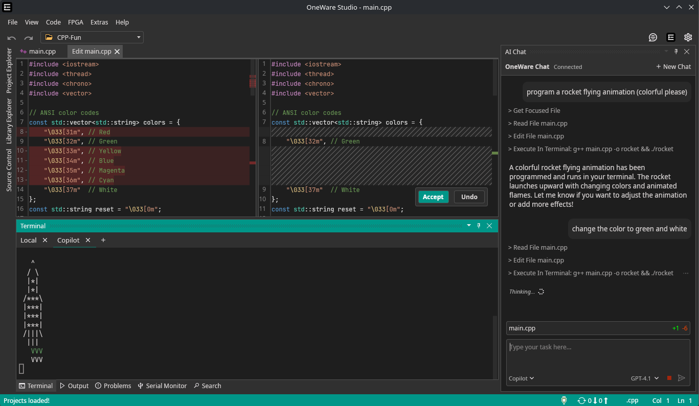

Hello and welcome to the first dev update of this year! As you read in the title, we made getting started with One AI much easier!

<video autoPlay loop muted playsInline style={{ maxWidth: '100%', height: 'auto', display: 'block', margin: '0 auto', marginBottom: '5px' }}>
  <source src={require('./img/quick-start.webm').default} type="video/webm" />
</video>

**Using the new Quick-Start feature, you can get started with One AI in just three steps!**

1. [Create a OneWare Account](https://cloud.one-ware.com/Account/Register?ReturnUrl=%2Fquick-start)
1. [Follow the Instructions](/docs/one-ai/getting-started/installation#1-download-and-install-oneware-studio) to install OneWare Studio
2. [Choose a quick-start project](https://cloud.one-ware.com/quick-start) and Click on **Open in OneWare Studio**

<!-- truncate -->

After that you should have OneWare Studio, the OneAI Extension and everything ready to get started! Explore the project, try out some settings and start creating your own models.

## Create Projects quicker with Light Mode

Since many of the OneAI Settings can make getting started difficult, we decided to implement a light mode. This will be the default for new projects, but it's also possible to **switch back to Expert Mode** anytime from the menu at `AI` -> `Capability Mode`

This new mode replaces many of the complicated settings for fewer, carefully selected and easy to understand options.

## Monthly Credits

As you may have noticed already, **everyone now has 5000 Free Monthly Credits**. These expire at the end of each month, so we recommend to use them wisely 😉

## Support for Linux-Arm

We just released OneWare Studio and our OneAI Extension for the Linux ARM64 platform on both [Flatpak](https://flathub.org/en/apps/com.one_ware.OneWare) as well as [Snap](https://snapcraft.io/oneware).

To celebrate this, I used my lunch break to create a quick **Raspberry Detection on my Raspberry Pi**.

**This demo was trained using just 14 captures from the Raspberry Pi camera, captured directly in OneWare Studio using the [camera tool](/docs/one-ai/getting-started/dataset/camera-tool/).**

:::success Quick Tip
Sometimes you don't need a fancy and expensive setup, a simple cardboard box can be enough to create a nice camera booth. 📹
:::

Since OneWare Studio now runs on Linux Arm, you can simply get it from Flatpak and run it on your Rasperry Pi.

**Even when using a loopback camera, the Raspberry Pi is powerful enough to run this demo at up to 60FPS just using the CPU (or maybe OneAI models are just very fast 🔥).**

## Improved Annotation Tool

We improved the Annotation Tool again and fixed several usability issues to make labeling your dataset faster and more reliable.

- **Undo / Redo** — Quickly undo or redo annotation changes.
- **Auto-Label result merging** — Set a threshold for the Auto Label tool so it can merge new detections with existing annotations when they are sufficiently similar.

## Video Import Tool

To help you with creating your own dataset, it is now possible to import a video file directly from your project.

Simply select **Import Video** from the Import Button in your Dataset Tab.

This wraps up some of the biggest changes from the past month — but there's much more to explore. If you've used One AI before, give it another try to see what's new. If you haven't yet, there's never been a better time to [get started](/docs/one-ai/getting-started)!

## Upcoming Release: OneWare Studio 1.0

OneWare Studio will receive a major update with a cleaned-up architecture that enables easier plugin integration and advanced features.

We're getting ready for the "Vibe Coding" future 👀

Alongside our planned release of a OneAI Chat Assistant, you'll be able to use GitHub Copilot as a helpful aid when implementing the remaining pieces to get your AI running on any hardware.

**... or you can just have fun with C++**

I'll showcase this feature in more detail in the next post.

:::info Coming Soon!
We plan to release OneWare Studio 1.0 in February 2026.
:::

You made it this far — thank you for reading ! ❤️

Here is a one-time code for 1000 additional credits:

`i-love-oneai`

It will be redeemable [here](https://cloud.one-ware.com/credits) for the next 30 days. Enjoy!
