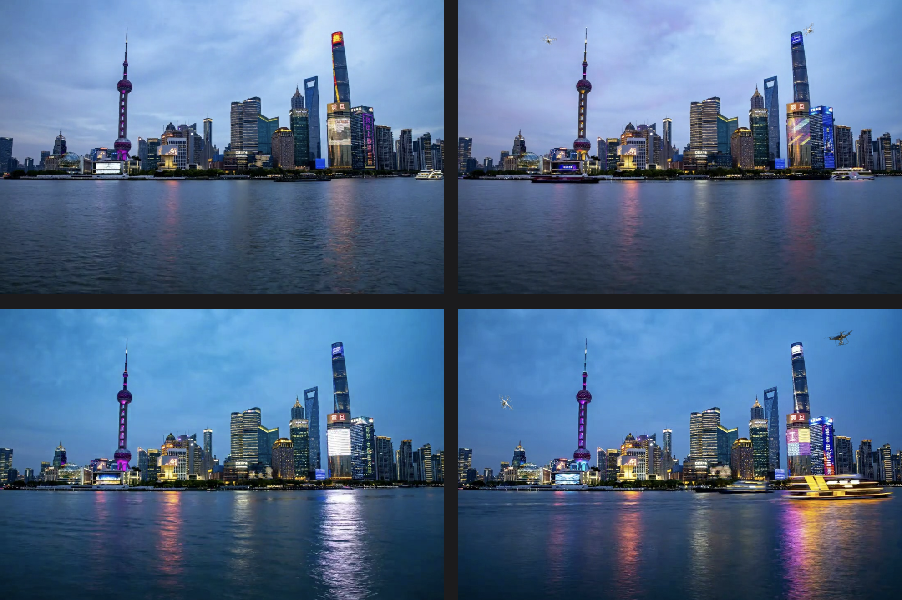

Vision AI has become a core technology in industry, security systems, and medical imaging. In many real-world applications, however, decisions are not based on a single image. Instead, multiple images are available: reference images, temporally shifted frames, multiple camera perspectives, or different imaging modalities.

Traditional Vision AI models have historically been designed to process individual RGB images. This assumption increasingly fails to reflect practical deployment scenarios.

## Typical use cases that are only partially solvable with single-image approaches include:

- Quality inspection using reference patterns  
- Detection of small changes in largely static scenes  
- Multi-camera object recognition  
- Fusion of RGB and depth data  
- Analysis of medical image series (e.g., MRI slice data)

In these scenarios, the decisive factor is not the isolated image content, but the comparison between images.

## Multi-Image Vision AI as a Structural Advantage

Multi-Image Vision AI refers to approaches in which multiple images are evaluated jointly. The ONE AI platform by ONE WARE natively supports this concept by integrating multiple image sources as equal inputs directly into the model architecture.

The key factor is not the number of images, but the model’s ability to structurally capture relationships, differences, and consistencies between them. In contrast, classical object detection models such as YOLOv8 process each image independently. Context from reference or comparison images is not available to the model.

In quality inspection, surveillance, and monitoring applications, the task is rarely to detect objects “freely” within an image. Instead, the goal is to reliably identify small deviations between a known reference state and a current image state.

Single-image models are forced to learn background, scene structure, and relevant objects simultaneously.

Reference-based object detection follows a fundamentally different paradigm. The reference image provides explicit contextual information. The AI no longer needs to learn what remains constant, but can focus directly on what has changed.

In the demonstrated ONE AI use case, reference and test images are processed in spatial alignment. In addition, a pixel-wise difference between both images is computed and used jointly with all color channels of both images as model input.

This overlap-difference representation leads to:

- Suppression of static image components (buildings, sky, background structures)  
- Amplification of small, relevant objects or changes  
- Reduction of the effective problem complexity for the model  

Unlike single-image approaches, the comparison is not learned implicitly, but provided explicitly.

## Benchmark Scenario: Drone and Bird Detection Using Reference Images

To quantitatively evaluate this approach, a synthetic dataset was created consisting of paired images of an urban skyline scene (Figure 1). A reference image shows the scene without target objects, while the corresponding test image contains inserted small objects such as birds or drones.

**Figure 1:** Reference images (left) and corresponding test images with inserted target objects (right) for reference-based object detection

<!-- truncate -->

### Dataset characteristics

- Small target objects (7–10% of image size)  
- High background complexity due to building structures  
- Varying illumination and slight temporal offsets  
- 259 image pairs (reference + test)  

## Benchmark Results: Multi-Image vs. Single-Image Vision AI

| Model                        | F1 Score (%) | Architecture Approach              |
|-----------------------------|--------------|------------------------------------|
| ONE AI (Overlap Difference) | 93.2         | Task-specific, Multi-Image         |
| YOLOv8 (Single Image)       | 56.0         | Generic single-image model         |

The benchmark results reveal a clear structural advantage of multi-image approaches over single-image Vision AI. With an F1 score of 93.2% compared to 56.0%, the multi-image method achieves an improvement of more than 39 percentage points, reducing the error rate by more than an order of magnitude.

While single-image models such as YOLOv8 must infer relevant objects solely from the complete image content, the multi-image approach benefits from explicit reference context. The comparison between reference and test images performs a pre-selection of relevant regions before classification.

This enables reliable detection of small or weakly visible objects even in highly complex backgrounds.

In the presented use case, this is achieved through pixel-wise difference computation between reference and test images. This difference information is used jointly with all color channels of both images as model input.

Static image elements such as buildings, sky, or unchanged background structures are effectively suppressed, while true changes are selectively emphasized.

In contrast, a single-image model must learn this separation entirely from the individual image, significantly increasing task complexity.

Furthermore, the model architecture generated by ONE AI is explicitly designed for difference-based detection. Instead of relying on a universal, pre-trained network, a lightweight, task-specific model is created that efficiently processes only the relevant information.

In this benchmark, the resulting model is approximately eight times smaller than YOLOv8, requiring significantly fewer computational resources without sacrificing detection accuracy.

## Extending Multi-Image Vision AI to Multiple Views and 3D Data

The reference-based multi-image principle demonstrated in this benchmark is not limited to image pairs. It generalizes to a wide range of multi-image and multimodal scenarios.

The decisive factor is the model’s ability to jointly and structurally evaluate multiple correlated inputs.

A key application is the use of multiple camera perspectives of the same object. In industrial inspection, individual viewpoints often provide only partial information. Robust assessment of geometry, completeness, or surface quality emerges only when multiple views are compared.

Multi-image approaches provide this perspective context explicitly rather than forcing the model to infer it implicitly from single images.

A similar advantage applies to the fusion of RGB and depth data, for example from stereo, time-of-flight, or LiDAR systems. While RGB images capture texture and color, depth data adds geometric information.

Joint evaluation reduces ambiguities caused by occlusions, varying illumination, or complex surfaces.

Temporal image sequences can also be understood as an extension of reference-based comparison. Changes between successive frames can be analyzed in the same way as reference and test images, enabling condition monitoring, anomaly detection, and process control.

Here again, the focus is not on the individual image, but on change over time.

The relevance of this approach is particularly evident in medical imaging. In modalities such as magnetic resonance imaging (MRI) or computed tomography (CT), diagnostic insight often emerges only from the comparison of multiple slices, sequences, or modalities.

Individual images provide limited information in isolation, whereas reliable interpretation depends on the joint analysis of spatial and functional relationships.

## Conclusion

Multi-Image Vision AI addresses a growing class of real-world applications that cannot be adequately solved using classical single-image models. Comparing reference and test images enables robust detection of relevant changes while significantly reducing model complexity. The presented ONE AI use case demonstrates that the explicit integration of multiple image sources can lead to substantially superior detection performance. For applications in quality inspection, surveillance, and multimodal image analysis, Multi-Image Vision AI represents a decisive next step in the evolution of modern computer vision systems.

