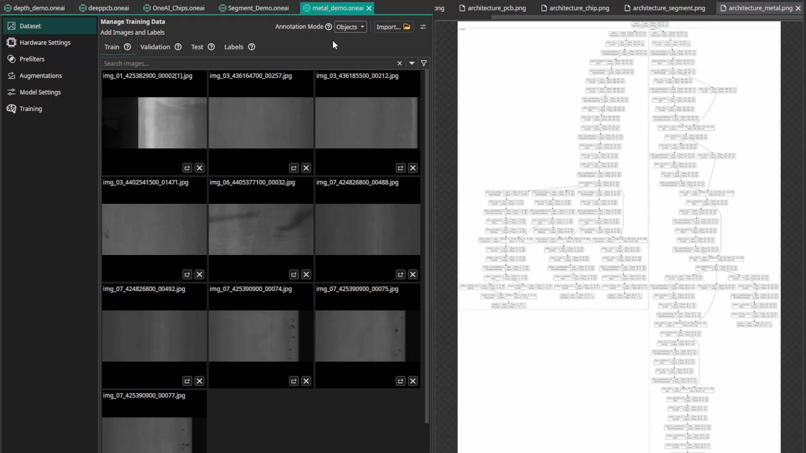
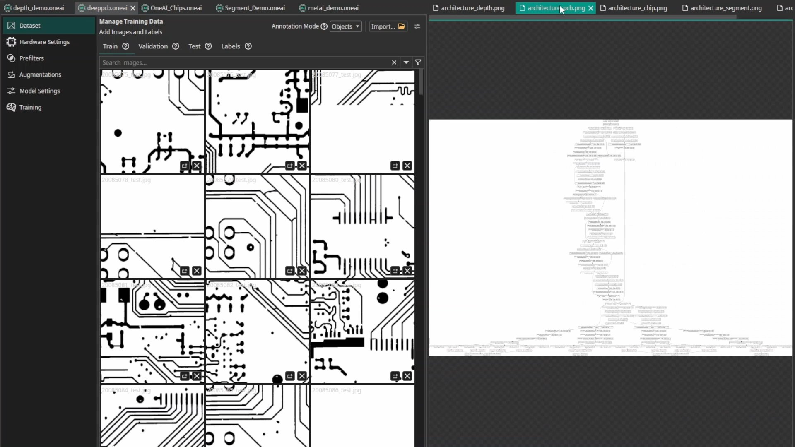
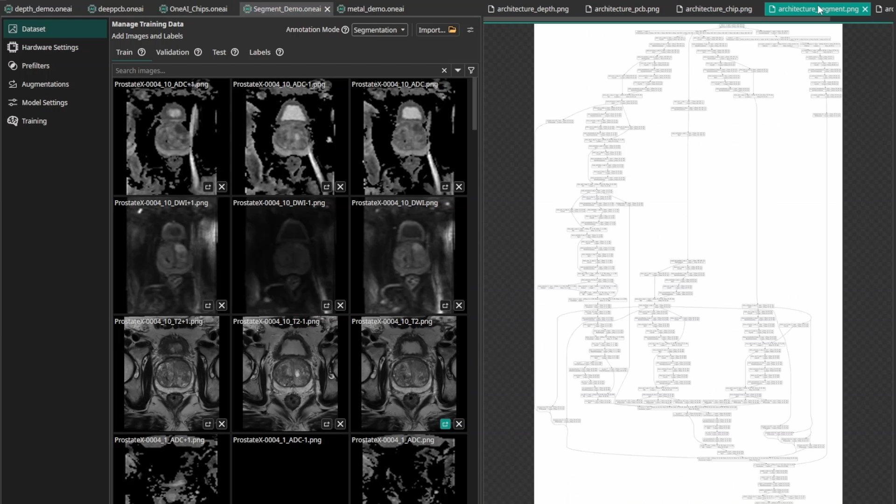
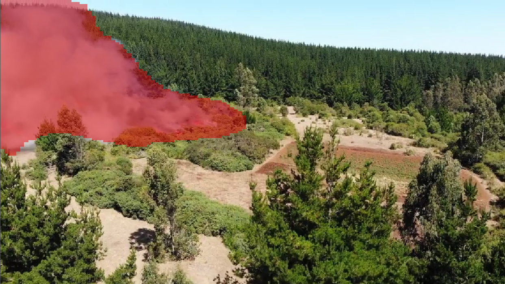
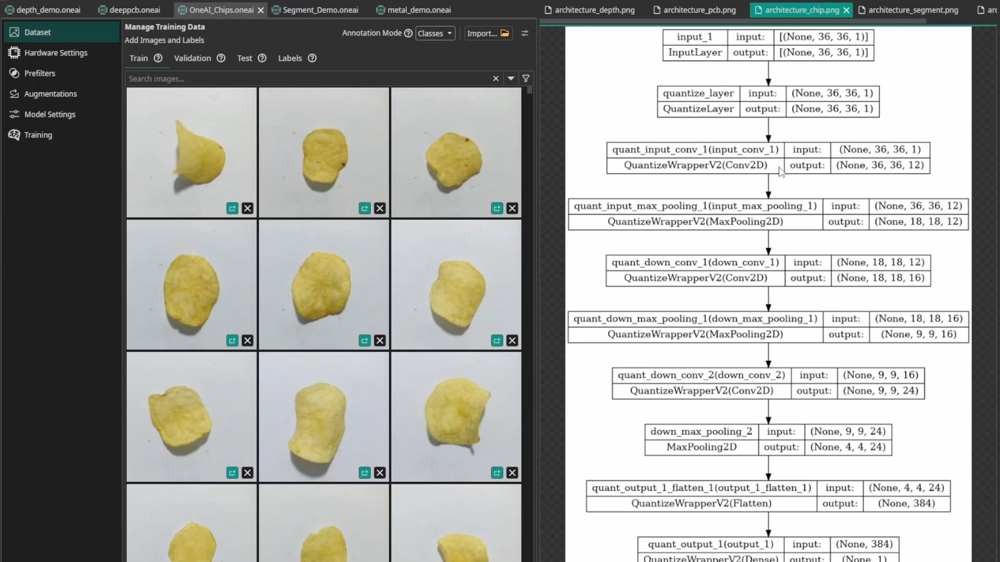
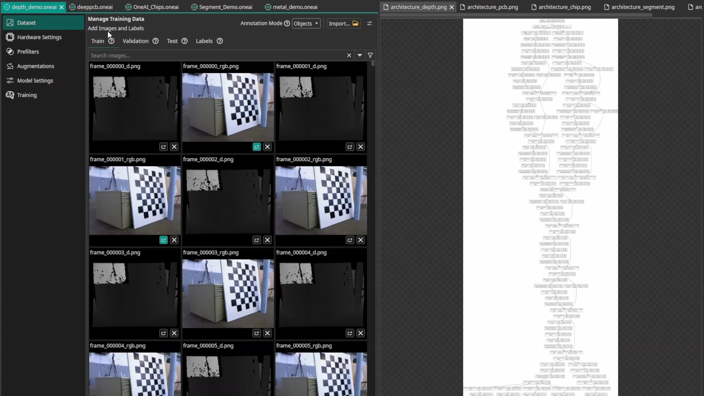
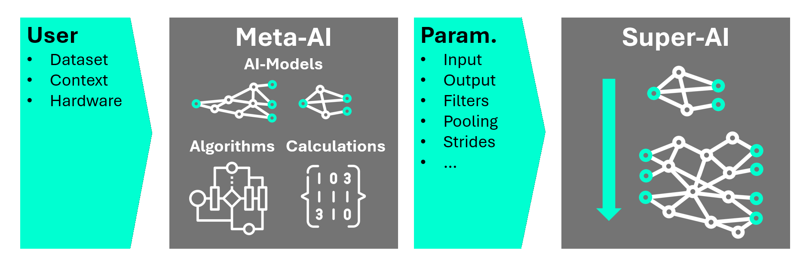

import videoUrl from './img/compare_architecture.webm';

<video controls autoPlay loop muted playsInline width="100%">
  <source src={videoUrl} type="video/webm" />
  Your browser does not support the video tag.
</video>

*Above: ONE AI generating completely different architectures for Depth Data analysis, Image Comparison (QC), Fast Small Object detection, and complex MRI classification. These are actual generated neural network architectures.*

If you are building a computer vision system today, the default advice is usually: "Just fine-tune YOLO." If that doesn't work, "Just try this other universal AI model." These universal models are robust and easy to use for some standard tasks.
We kept running into cases where "just fine-tune YOLO" was the wrong abstraction, especially for high-speed industrial inspection or edge robotics.

{/* truncate */}

**For these engineering applications generic assumptions often break down, and you can achieve significantly better results with a tailored approach.**

We designed a software to bridge this gap. Instead of trying to force a pre-trained model to work on data it wasn't designed for (like 3D MRI scans or high-speed microscopic images), a task-specific neural network architecture is predicted based on your dataset and constraints.

I will show 7 examples where this approach works best and what decision our software, ONE AI, makes to get better results. So even if you develop neural network architectures your own, you can take these tips to get better results.

## 7 Engineering Scenarios Where Generic Models Struggle

Here is a technical look at why "off-the-shelf" models fail in specific domains, and how tailored architectures solve the problem.

### 1. Detection of Tiny Objects

Detecting tiny defects (like pores) alongside larger features (like scratches) is a massive challenge. Generic models often struggle with very small objects because their receptive fields are too large, losing fine detail.

ONE AI generates **Multi-Scale Architectures**. It combines an "Expert AI" branch with a large receptive field for big features (scratches) and a separate branch optimized for small objects with a more focused receptive field. This ensures that both microscopic pores and macroscopic defects are detected with high precision in a single pass.

### 2. Video Object Detection (Temporal Motion)

Standard object detectors treat video feeds as a sequence of completely independent images. If an object becomes blurry, occluded, or rotates into an unrecognizable angle for a single frame, the detection fails.

ONE AI solves this by analyzing **image differences** directly within the architecture. By comparing the current frame with previous frames (temporal motion), the model focuses on the *changes*.
**The Result:** In our benchmarks, this approach achieved an **F1-Score of 95.7%** compared to just **56% with YOLOv8**, resulting in **10x fewer errors** while using significantly less compute. (Result: 95.7 F1 vs 56.0 with YOLOv8 on our benchmark — [details here](/docs/one-ai/demos/difference-image-demo))

### 3. Image Comparison (Reference QC)

In manufacturing, comparing a production part against a reference image (good part) is a powerful strategy, but standard AIs don't natively understand "comparison."

ONE AI builds **Hybrid Comparison Architectures**. The model takes both the live image and the reference image as inputs. It splits into two streams: one branch specifically analyzes the *differences* between the images (comparison), while another branch analyzes the *general features* of the live image.
**The Result:** ONE AI achieved a **98.4% F-Score**, outperforming both specialized "human-designed" architectures (98.2%) and generic models like YOLO (93.1%), while running **7x to 13x faster**. (Result: 98.4% F-score, ~465 FPS — [benchmark table here](/docs/one-ai/use-cases/pcb/))

### 4. Medical Technology

Medical data often involves 3D volumes (MRI slices) or multiple image types. Standard 2D models often fail to capture the full context across the Z-direction or between modalities.

ONE AI adapts the architecture with **Multiple Parallel Branches**. It can process multiple slices (Z-direction) or different image types in separate streams, fusing them deeper in the network. This allows the model to learn complex 3D relationships and cross-modality features that a simple 2D model would miss.

### 5. High Speed Segmentation

Running segmentation on a drone requires detecting fire and smoke instantly with very limited hardware resources. A standard U-Net is often too heavy and slow for this.

ONE AI designs **Application-Specific Segmentation Models**. Since the task is specialized (just fire/smoke vs. background), the model doesn't need the massive capacity of a general-purpose AI. The system generates a significantly smaller, highly optimized architecture that fits easily on an embedded CPU while delivering the necessary speed and accuracy.

### 6. High Speed Classification on Efficient Hardware 

Quality control of potato chips requires checking thousands of items per second. A large, generic AI is overkill and too slow for the required millisecond-level reaction times.

ONE AI creates **Extreme-Efficiency Micro-Models**. Because the visual task is specific (e.g., spotting brown spots), the architecture is stripped down to the absolute essentials.
**The Result:** Deploying this micro-model on a low-cost FPGA ($45) achieved **1736 FPS** with **0.086ms latency** and **99.5% accuracy**. A generic model (VGG19) on a Jetson Orin Nano ($250) only managed 24 FPS and 88% accuracy. That's **70x faster** at a fraction of the cost. (Result: 0.086ms latency — [details here](/docs/one-ai/demos/potato-chip-demo))

### 7. Combine Camera and Depth Informations

Simply stacking Depth and RGB data together often confuses standard models, as geometric distance and color texture are fundamentally different types of information.

ONE AI uses **Deep Feature Fusion**. It treats Depth images and RGB images as separate inputs, analyzing them in independent branches of the neural network. The features are then fused deeper in the architecture. This allows the AI to "understand" geometry and texture separately before combining them for a robust decision.

## How ONE AI Builds Custom Neural Networks

Standard AI development typically forces a tradeoff: **Transfer Learning** uses bloated models that only work well on standard data, while **Neural Architecture Search (NAS)** burns massive amounts of compute to blindly test thousands of variations.

**ONE AI takes a smarter path: It predicts an architecture configuration that matches the dataset and deployment constraints**

We built an **architecture prediction model** that acts as an intelligent architect. It analyzes your dataset (e.g., object scales, number of classes), context (e.g., controled vs natural environment), and hardware constraints to predict the optimal neural network structure.

The insights drive our **Flexible Super Model**, a highly adaptive framework that reconfigures itself on the fly. It can shrink to a tiny micro-model for an FPGA or expand into a complex multi-branch network similar to YOLO or U-Net, depending entirely on what your specific task demands.

The result? A model mathematically optimized for specific needs, often significantly smaller and faster than generic baselines in our current benchmarks, unlocking deployment on hardware where standard AI simply cannot run.

### Reproduce This

Generic models are powerful, but they aren't designed for every specific engineering constraint. ONE AI predicts a task-specific architecture based on dataset and constraints.

**If you want to reproduce the demo, here’s the Quick Start + example projects** You can download ONE WARE Studio for free and test it on your own dataset.

*   [**Quick Start Guide**](/docs/one-ai/getting-started/quick-start-guide) - Have your first AI running in minutes.
*   [**Tutorials & Demos**](/docs/one-ai/demos/overview) - Explore real-world examples.

