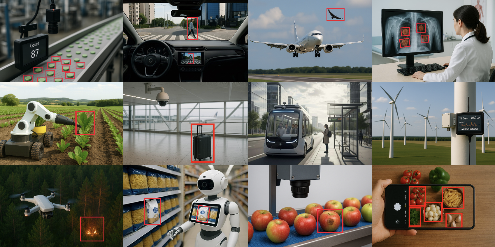

Vision AI has become a key innovation driver across almost every industry—from automated quality inspection and medical imaging to agricultural inspection and autonomous machine perception.

In practice, what matters is not a single model, but the ability to solve many different and highly specific vision tasks reliably: detection, classification, segmentation, anomaly detection, and more.

ONE AI positions itself exactly here: as the AI for all Vision AI applications.

<!-- truncate -->

## How ONE AI Can Cover Any Vision Task

Traditional Vision AI approaches typically rely on a toolbox of universal model families such as YOLO, U-Net, or ResNet.

These models are powerful, but they always come with trade-offs:

- They were designed to cover as many tasks as possible  
- They require manual adaptation, optimization, and tuning  
- Deployment to target hardware often becomes complex  

ONE AI takes a fundamentally different approach with **Neural Architecture Prediction (NAP)** compared to Transfer Learning and Neural Architecture Search (NAS):

Instead of adapting an existing model, ONE AI automatically predicts a **custom, task-specific AI architecture** for every vision problem.

The result:

- One system for all vision tasks  
- No model selection, no manual tuning  
- A unified workflow for development, training, and deployment  

This makes Vision AI application-driven rather than model-driven for the first time.

## Higher Accuracy Through Specialization

ONE AI not only increases flexibility—it also delivers measurably better results.

Universal models must represent many different features at once. ONE AI, by contrast, creates models that learn only what is relevant for a specific task.

This consistent specialization leads to:

- higher test accuracy  
- more stable generalization  
- less overfitting  

### Benchmark Example: Potato Chip Quality Inspection

What specialization means in practice is demonstrated by a benchmark whitepaper for potato chip quality inspection:

| Model Approach              | Accuracy (%) | Performance | Hardware Requirement |
|----------------------------|--------------|-------------|----------------------|
| Generic Reference (VGG19)  | 88.0         | 24 FPS      | Nvidia Jetson Orin Nano |
| ONE AI Micro-Model (NAP)   | 99.5         | 1,736 FPS   | Low-cost FPGA |

ONE AI generated a task-specific micro-model achieving:

- **0.086 ms latency**
- **~72× higher throughput**
- **significantly lower hardware cost**

## Industry-Wide Vision AI Applications

ONE AI is not a specialized solution for a single case, but a platform logic that can be transferred to any vision task.

Because ONE AI derives the architecture from:

- the task  
- the data  
- and the target hardware  

…it automatically produces the right model for each application.

This is what makes **“ONE AI for all Vision AI applications”** practical:

- the same platform  
- the same workflow  
- but an optimally tailored vision model for each industry and use case  

## Manufacturing

This becomes especially tangible in manufacturing, where many visual sub-tasks occur in parallel and must run reliably under real-time conditions.

 

ONE AI covers:

- Quality control  
- Smart manufacturing  
- Predictive maintenance  
- Robotics integration  

Typical applications include:

- Defect and assembly error detection (OK/NOK, defect classes)  
- Completeness checks and counting  
- Early anomaly and wear identification  
- Visual guidance for robotics processes  

All without having to repeatedly “bend” universal models like YOLO or rebuild AI infrastructure.

## Healthcare

In healthcare, precision, reliability, and data privacy are critical—often with the requirement that AI runs directly where care happens.

 

ONE AI enables Vision AI locally on existing medical devices, supporting:

- Medical image analysis (X-ray, MRI, ultrasound interpretation)  
- Prescription & Inventory Verification (medication safety checks)  
- Automated equipment inspection (instrument condition monitoring)  
- Continuous patient monitoring (early detection of critical changes)  

Through automated model creation and integration, ONE AI shortens the path from idea to clinical routine.

## Food & Beverage

In food & beverage production, quality decisions must be made under constant variation:

- Natural product differences  
- Changing lighting  
- Packaging variability  
- High-speed production lines  

ONE AI reliably covers:

- Ingredient & contamination inspection  
- Packaging & Label Verification (compliance and traceability)  
- Automated production quality steps  
- Bottling and filling line monitoring (fill level, cap alignment, label positioning)  

## Agriculture

Agriculture presents one of the most challenging Vision AI environments:

- Weather changes  
- Seasonal variation  
- Unstable lighting  
- Dynamic perspectives  

ONE AI runs directly on tractors, drones, and IoT edge devices, generating models tailored to the dataset and resource budget.

Applications include:

- Crop stress detection (disease, drought, nutrient deficiency)  
- Livestock monitoring (behavioral anomaly detection)  
- Precision farming (targeted spraying, irrigation, harvesting)  
- Field analytics directly on machines—even without stable connectivity  

With ONE AI, Vision AI becomes a repeatable capability rather than a one-off project.

## Conclusion

ONE AI represents a new paradigm for Vision AI deployment:

Instead of selecting and adapting universal architectures, ONE AI automatically predicts task-specific models optimized for accuracy, speed, and hardware constraints.

This enables a single unified platform for:

- Detection  
- Segmentation  
- Classification
- Anomaly detection  
- Industrial inspection  
- Medical imaging  
- Agriculture and beyond  

**ONE AI is the AI for all Vision AI applications. Because every vision task deserves its own optimal architecture.**

