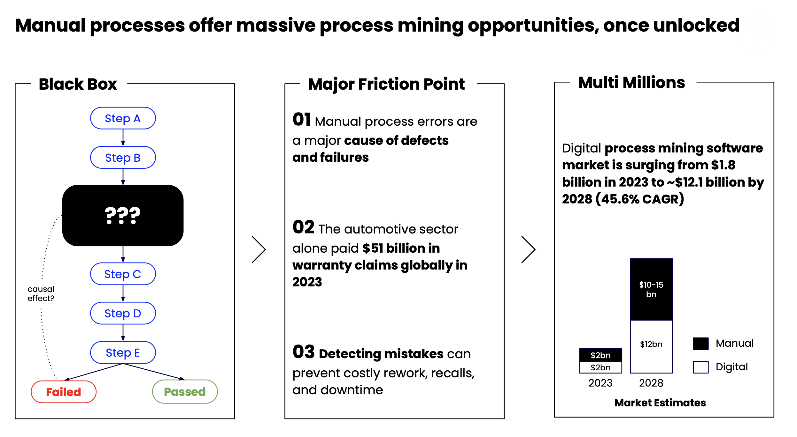
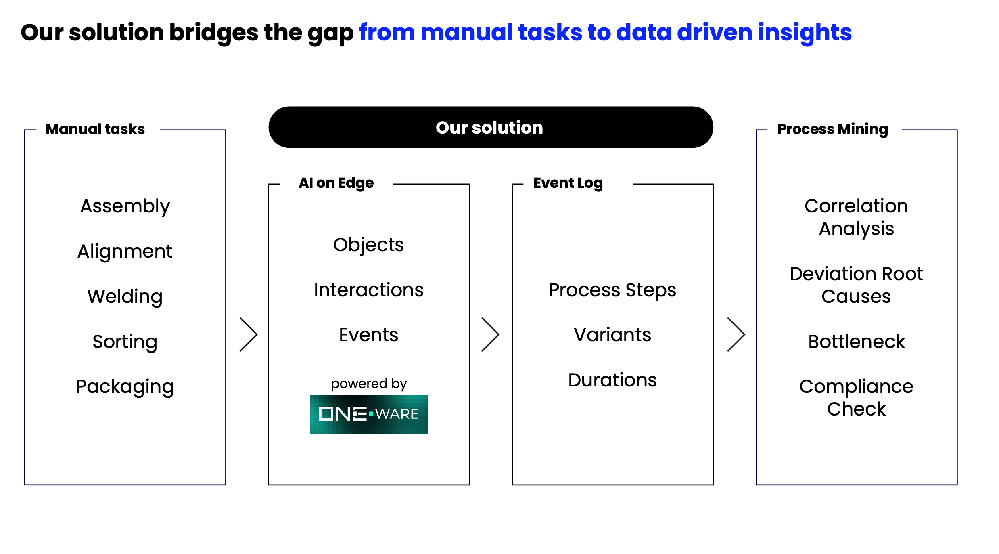
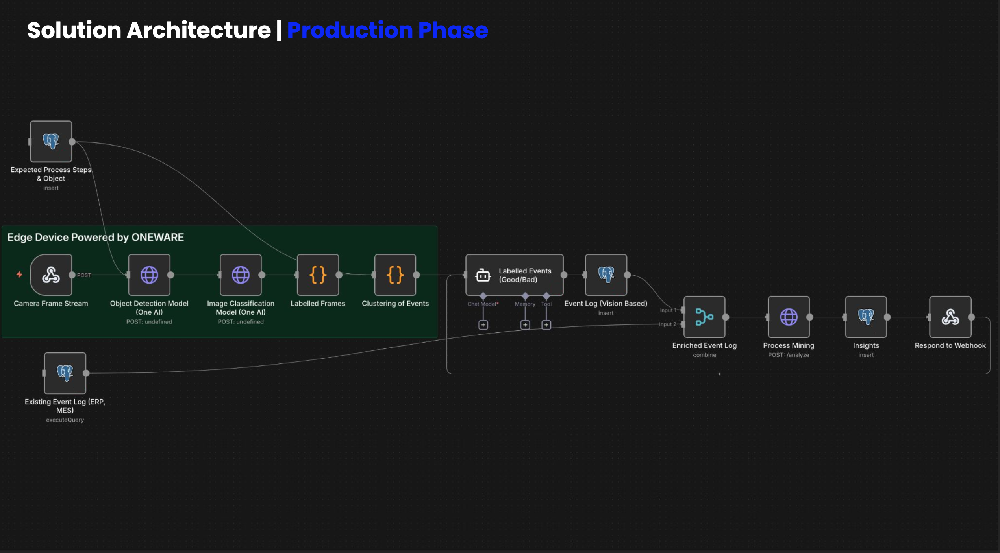
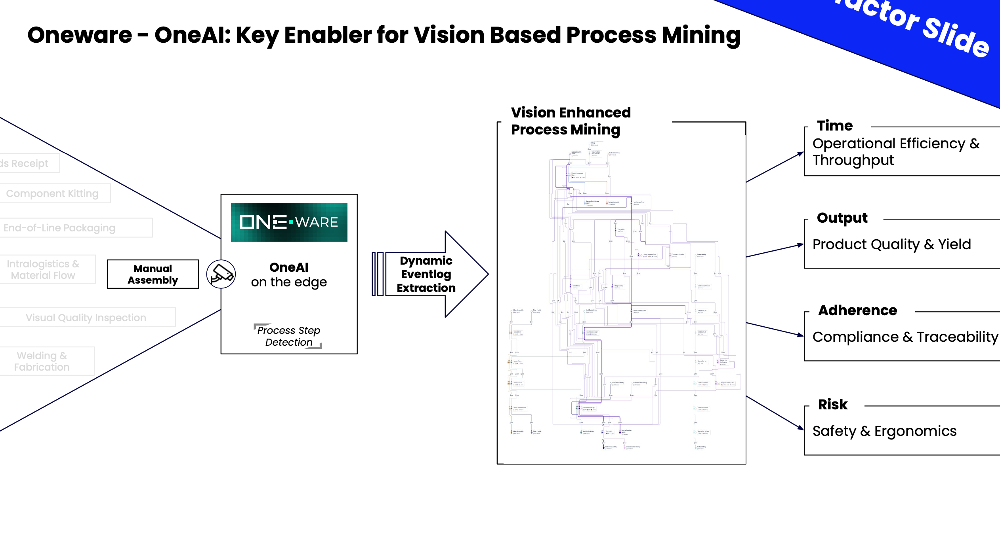
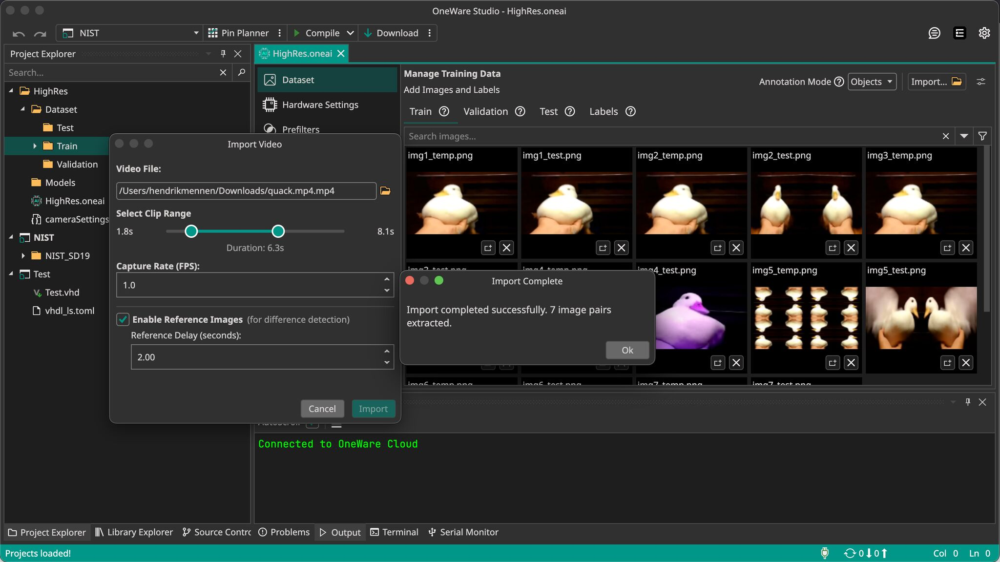

# Vision AI Based Process Mining in 24 Hours

As a challenge sponsor, we gave the teams access to our ONE AI platform.

The challenge: Develop a working computer vision prototype in any application domain and demonstrate how ONE AI can be used to:

- run AI creatively and locally on lean hardware  
- tailor models precisely to the specific application  
- and thereby outperform classical, generic AI approaches  

Our results series starts with the winning team. They not only solved this challenge, but went on to win the entire hackathon.

<!-- truncate -->

## From Computer Vision to Structured Process Intelligence

### The Solution: Vision-Based Process Mining

Classical Process Mining relies on structured digital event logs. Wherever processes are carried out manually, this data does not exist. Manual assembly steps, inspections, and human-driven workflows remain analytically invisible.

This is exactly where the team started and the challenge began: 

Process camera data from real workplaces locally using Computer Vision, interpret it semantically, and automatically transform it into structured event logs suitable for Process Mining.

## Real-Time Edge AI: From Video Stream to Event Log

Within just 24 hours, they built a fully functional Vision AI prototype.

Video streams were processed in real time on edge devices. Objects and human activities were detected and classified using task-specific models generated by ONE AI. Process steps — including timestamps — were dynamically extracted and converted into structured event logs.

Training, inference, and event correlation all ran entirely locally. Process deviations such as missing steps, incorrect sequences, or duplicates were detected automatically. The resulting structured data could be directly integrated into existing Process Mining and industrial analytics tools.

What was previously an invisible manual workflow became a Digital Twin of the real process.

## From 24-Hour Prototype to Integrated Platform Feature

This prototype demonstrates more than a Computer Vision use case. It enables complete industrial Vision AI pipelines at the edge — from real-time perception to structured process intelligence.

What would typically require months of AI development, system integration, and hardware optimization was implemented in a single day.

Vision-based Process Mining is just one of nearly infinitely many possible use cases that can be implemented with ONE AI in a very short time.

The result was so compelling that we decided to integrate this capability directly into ONE AI. Users can now generate classification datasets from video data significantly faster, accelerating the path from raw video to deployable Vision AI models.

This hackathon solution illustrates how rapidly complex industrial Computer Vision applications can be realized when model generation, hardware alignment, and deployment are automated from the beginning.
