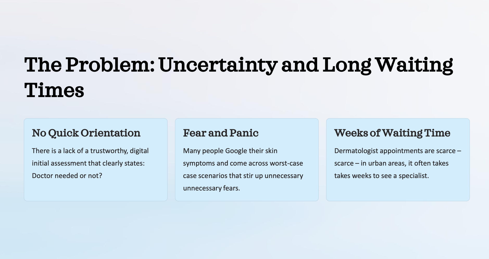
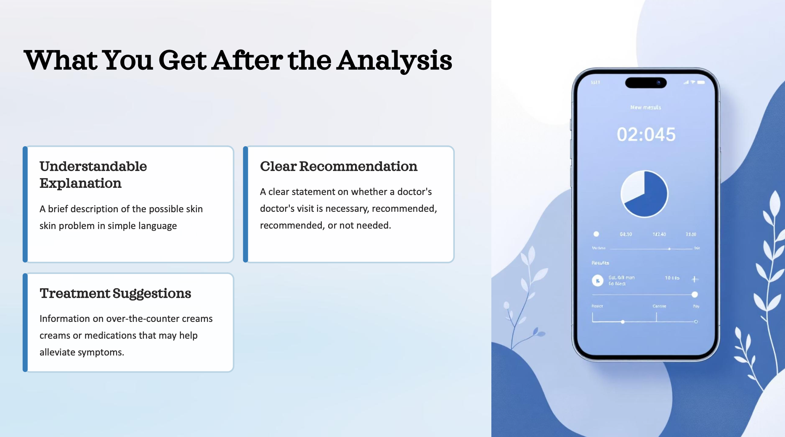
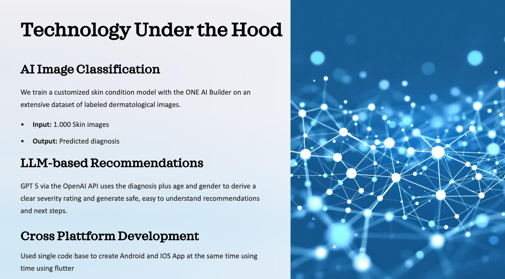

# Vision AI for Digital Dermatology in 24 Hours

As a challenge sponsor at the Munich AI Hackathon, we gave participating teams access to our ONE AI platform.

The challenge: Develop a working computer vision prototype within 24 hours and demonstrate how ONE AI can:

- run AI locally on lean hardware  
- tailor neural networks precisely to the application  
- and outperform classical, generic AI approaches  

Our next featured project:

**SkinGuard: AI-powered initial assessment of skin problems via smartphone.**

<!-- truncate -->

## The Problem: Uncertainty, Fear, and Waiting Time

Dermatological issues affect hundreds of millions of people worldwide.

Yet access to reliable first assessment remains limited.

- There is no trustworthy digital triage answering: *Doctor needed or not?*  
- Many patients rely on Google and encounter worst-case scenarios  
- In urban areas, dermatologist appointments often require weeks of waiting  

## The Solution: Instant Vision AI Initial Assessment

SkinGuard transforms a smartphone into a first diagnostic interface.

### Step 1: Take a Photo

The user photographs the affected skin area or uploads an existing image.

### Step 2: AI Analysis

A task-specific skin condition model generated with ONE AI analyzes the image and predicts the most probable diagnosis.

### Step 3: Receive Structured Guidance

The user receives:

- A clear explanation in simple language  
- A recommendation whether medical consultation is required  
- Suggestions for possible over-the-counter treatment  

## What This Demonstrates

What typically requires medical triage infrastructure is delivered through Vision AI on a mobile device.

A customized skin condition model was trained using ONE AI on labeled dermatological images.

This health-tech concept demonstrates how:

- A medical Vision AI model can be generated automatically  
- Deployment to mobile devices can happen immediately  
- AI combined with structured reasoning can create user-oriented guidance  
- End-to-end AI applications can be built within a single day  

What normally requires months of AI development, mobile integration, and model optimization was implemented in one day.

SkinGuard is another example of how ONE AI enables rapid realization of complex, domain-specific Vision AI applications — from dataset to deployable product.

