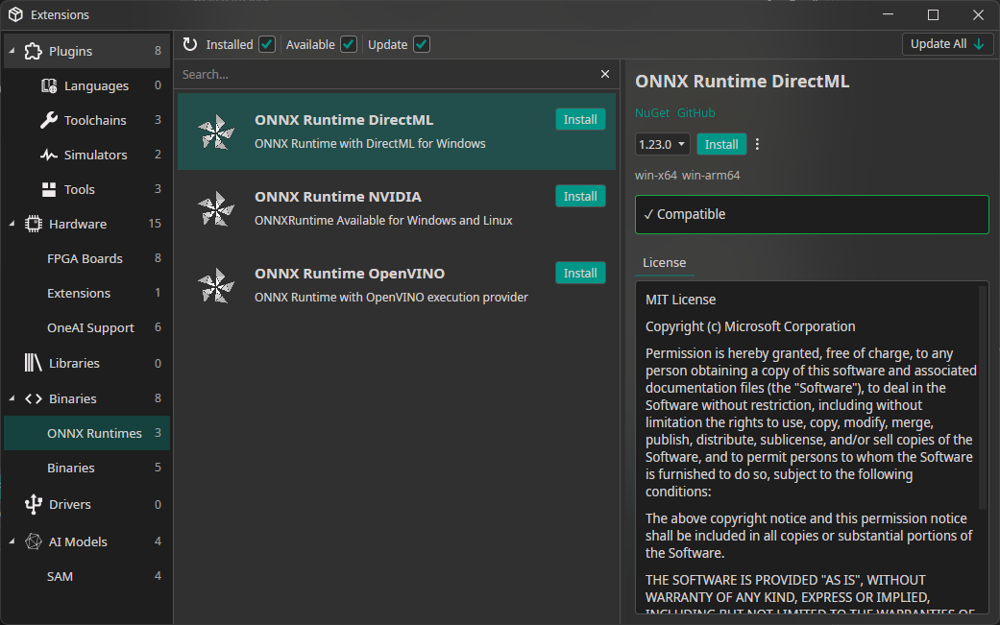
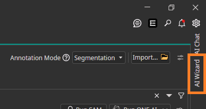
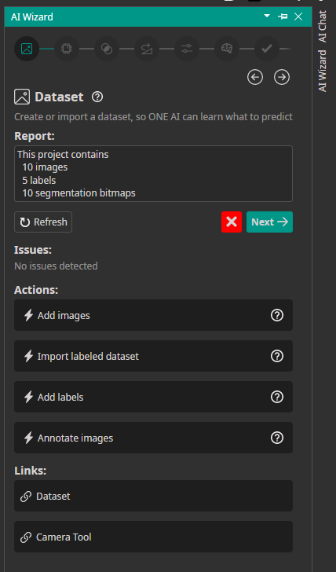

Hello and welcome to the February dev update!

This February we have made huge progress in ONE AI with new features focused on making dataset creation and AI development faster and more intuitive.

<video autoPlay loop muted playsInline style={{ maxWidth: '100%', height: 'auto', display: 'block', margin: '0 auto', marginBottom: '5px' }}>
  <source src={require('./img/sam-preview.webm').default} type="video/webm" />
</video>
**You can now label and segment datasets directly with a locally running Segment Anything Model!**

<!-- truncate -->

## Smart Labeling

Using Meta's open-source SAM v3 model, you can create datasets much faster.
Just open the SAM tool in the annotation window, type the object you want to detect, and within seconds you'll have pixel-perfect segmentations.
The SAM models run directly on your machine, so we offer multiple models to choose from based on your hardware. You can also use the smart fill brush: draw a bounding box around your target, select the label, and SAM will automatically detect the shape and draw the segmentation for you.

## ONNX Runtimes

Since SAM Models are large and need a lot of computing power, it is now possible to install support your your GPU / NPU directly from OneWare Studio.

There will be a guide for this too. For Windows (with a strong GPU) I recommend using DirectML since it does not need any additional drivers.

## AI Wizard

Building AI-powered workflows can get complex quickly. That's why we built the AI Wizard.

The AI Wizard is a guided setup experience inside ONE AI that walks you through creating and configuring your AI project from start to finish.
No more jumping between menus or guessing what comes next. The Wizard is divided into sections, and each section shows your current progress, any issues you need to fix, guided actions, and helpful documentation links. New users can get started quickly and learn as they go. Regardless of experience level, everyone benefits from a guided approach to creating their custom AI model.

### How to use the AI Wizard

Access the AI Wizard by clicking the "AI Wizard" button in the right sidebar.

The Wizard opens with the Dataset section. When you're satisfied with your progress and everything looks good, click "Next" to move forward. Your progress saves automatically to your ONE AI project folder.

## Segmentation Live Preview

The new Semantic Segmentation Live Preview lets you see your model in action instantly using your camera.

Select a camera and the system runs your segmentation model on the live video stream, showing predictions in real time. You can test how your model performs in real-world conditions without capturing or uploading images first.

The preview uses advanced shaders for real-time rendering, so you get fast visualization even during continuous video processing.

Validate results, spot issues early, and iterate faster on your computer vision project.

<video autoPlay loop muted playsInline style={{ maxWidth: '100%', height: 'auto', display: 'block', margin: '0 auto', marginBottom: '5px' }}>
  <source src={require('./img/segmentation-live-preview.webm').default} type="video/webm" />
</video>

## Video Record Feature

Collecting image data usually means recording footage, extracting frames, and uploading images to your dataset.

The new Video Record feature simplifies this.

Record a video directly from your camera and automatically import its frames into your dataset. When recording finishes, frames are extracted and added as images, ready for review and annotation.

Capture real-world scenarios and turn them into training data without leaving the platform.

<video autoPlay loop muted playsInline style={{ maxWidth: '100%', height: 'auto', display: 'block', margin: '0 auto', marginBottom: '5px' }}>
  <source src={require('./img/video-record-feature.webm').default} type="video/webm" />
</video>

## Dataset Bulk Actions

Managing datasets takes time. You need to review, label, organize, and clean large numbers of images before training can begin.

Bulk Actions is a new feature that lets you perform common dataset operations on many images at once.

With Bulk Actions, you can:

+ Automatically label images using SAM or ONE AI
+ Move images between datasets or folders
+ Delete images
+ Remove annotations

Automatic labeling with SAM and ONE AI helps you bootstrap annotations quickly so you can focus on improving models and building applications.

Bulk Actions is available now, helping you go from raw images to ready-to-train datasets faster.

## OneWare Studio 1.0 Release

We're also excited to announce OneWare Studio 1.0! This major release brings a completely reworked project system, stable plugin API, Windows ARM support, and built-in GitHub Copilot integration. Check out the full announcement [here](/blog/oneware-studio-1.0)!