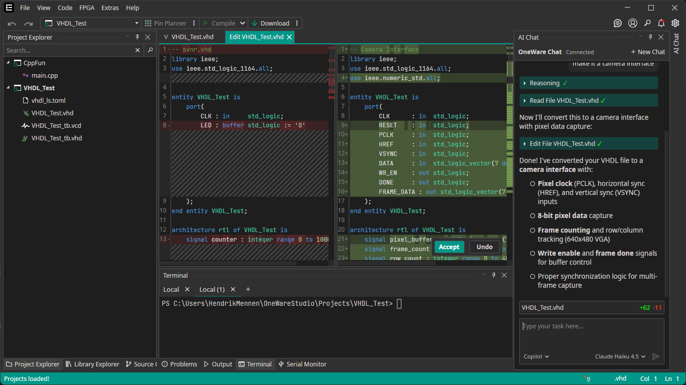

We are excited to announce the release of OneWare Studio 1.0!

This major milestone brings significant improvements in performance, stability, and cross-platform support, along with a stable plugin API that enables long-term plugin development.

<!-- truncate -->

## Improved Project System

1.0 reworked how Projects are loaded in OneWare Studio. Since OneWare Studio offers to load multiple projects at once, the old system had some performance issues before.
The new system uses full virtualization and a smart system that allows you to open projects with millions of files without suffering any performance penalty.

## Stable Plugin API

The goal in our 1.0 release was to have a stable plugin API, so developers can rely on a API that will work, allowing for long term plugin stability.

## Windows ARM Release

With adding Windows ARM to our supported platforms, we now support all 3 major Desktop Operating Systems on both x64 and arm64 architecture.

## Chat Assistant Integration

OneWare Studio now has an API that allows plugin developers to register their own Chat Assistants.
The most popular, GitHub Copilot, is already included into OneWare Studio.

