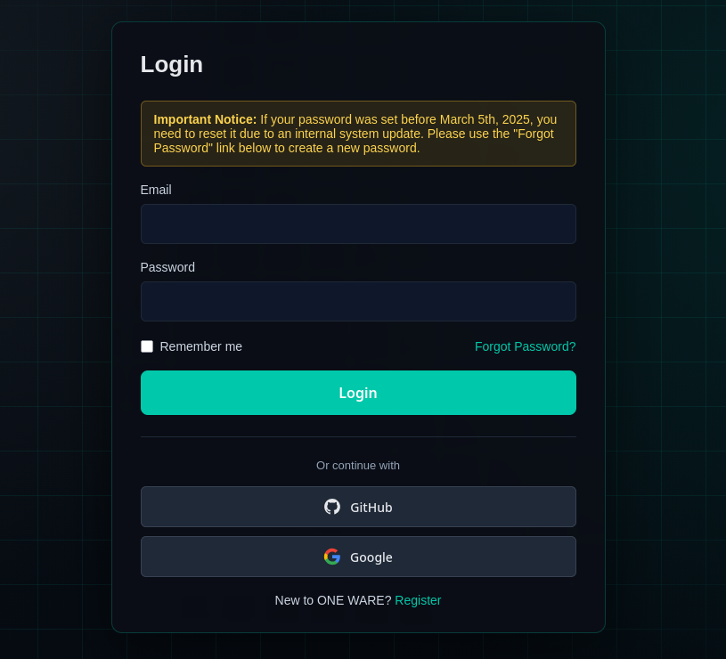

:::info SUMMARY
We changed our authentication provider for additional features and better scalability. This does not mean that there are any security issues.

**A password reset is required to log in to your account.**
:::

<!-- truncate -->

We migrated OneWare Cloud authentication from the default ASP.NET provider to Keycloak.

This change gives us a more robust identity platform and allows additional sign-in methods.

## Action required: reset your password

Because the password hashing mechanism changed with the migration, existing passwords cannot be reused automatically.

To access your account again, please reset your password once from the login page.

1. Open the OneWare Cloud login page.
2. Click `Forgot password`.
3. Follow the reset email link and set a new password.
4. Log in with your new password.

## New login options: GitHub and Google

You can now sign in with:

- GitHub
- Google

If you prefer social login, use the matching provider button directly on the login page.

Thank you for your patience while we roll out this change. If anything does not work as expected, contact us at [support@one-ware.com](mailto:support@one-ware.com).
