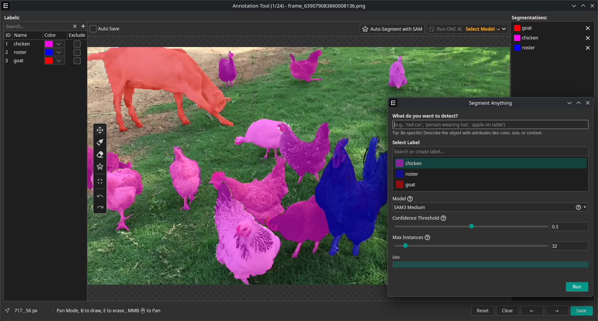

Hello and welcome to the second dev update of this year!

This february we have made huge progress in terms of usability, stability and performance.

<!-- TODO Add video>

<!-- truncate -->

## OneWare Studio 1.0

### Improved Project System

### Stable Plugin API

### Windows ARM Release

## Smart Labeling

By using Metas Open-Source Model SAM v3, you can create datasets much faster.
Simply open the SAM tool from the labeling mode and type the object that you want to detect, and after a few seconds of processing you will have pixel perfect segmentations of them.
The SAM Models are executed diretly on your machine, so we have multiple different models to chose from to fit your hardware.

## AI Wizard

## ONNX Runtimes

## Video Record Feature

## Dataset Bulk Actions