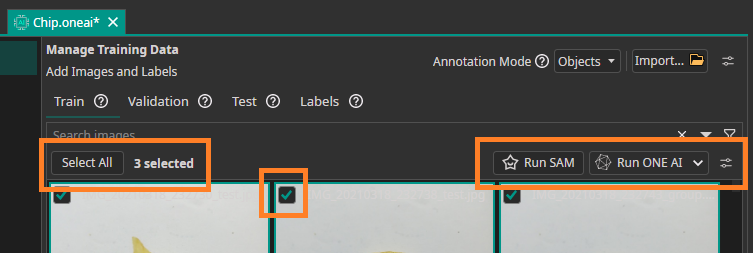

Hello and welcome to the second dev update of this year!

This february we have made huge progress in terms of usability, stability and performance.

<!-- TODO Add video>

<!-- truncate -->

## OneWare Studio 1.0

### Improved Project System

### Stable Plugin API

### Windows ARM Release

## Smart Labeling

By using Metas Open-Source Model SAM v3, you can create datasets much faster.
Simply open the SAM tool from the labeling mode and type the object that you want to detect, and after a few seconds of processing you will have pixel perfect segmentations of them.
The SAM Models are executed diretly on your machine, so we have multiple different models to chose from to fit your hardware.

## AI Wizard

Building AI-powered workflows can sometimes feel overwhelming—especially when you're faced with many configuration options, tools, and next steps. To make the process smoother and more intuitive, we built the AI Wizard.

The AI Wizard guides you step by step through the creation of your OneAI project, helping you stay focused while always knowing what to do next.

### What is the AI Wizard?

The AI Wizard is a guided setup experience inside OneWare Studio AI that helps you create and configure your AI project from start to finish.

Instead of navigating multiple menus or wondering which step comes next, the Wizard provides a clear path forward. It is divided into different sections, where
each section provides a report of the current progress, possible issues, guided actions and helpful documentation links. This helps new users to get started quickly and
get comfortable with the software. Independent of the experience, the user benefits from a guided way creating his powerful custom AI model 
as easy as possible.

### How to use the AI Wizard?

To access the AI Wizard, simply click on the "AI Wizard" button in the right sidebar. The Wizard will appear initially with the Dataset section. If you are satisfied with 
the progress report (or section in general) and don't have any issues, you can click on the "Next" button to move to the next section. The progress will be saved in your ONE AI
project location.

1. Click AI Wizard on the right sidebar 

2. Check the Wizards progress report, issues, actions and links

## ONNX Runtimes

## Video Record Feature

## Dataset Bulk Actions

Managing datasets is one of the most time-consuming parts of building computer vision models. Large numbers of images need to be reviewed, labeled, organized, and cleaned before training can even begin.

To make this process faster and more efficient, we’re introducing Bulk Actions — a new feature that lets you perform common dataset operations on many images at once.

With Bulk Actions, you can:

+ Automatically label images using SAM or ONE AI
+ Move images between datasets or folders
+ Delete images
+ Remove annotations

By enabling automatic labeling with SAM and ONE AI, you can bootstrap annotations quickly and focus your effort where it matters most—improving models and building intelligent applications.

Bulk Actions are available now, helping you move from raw images to ready-to-train datasets faster than ever.

