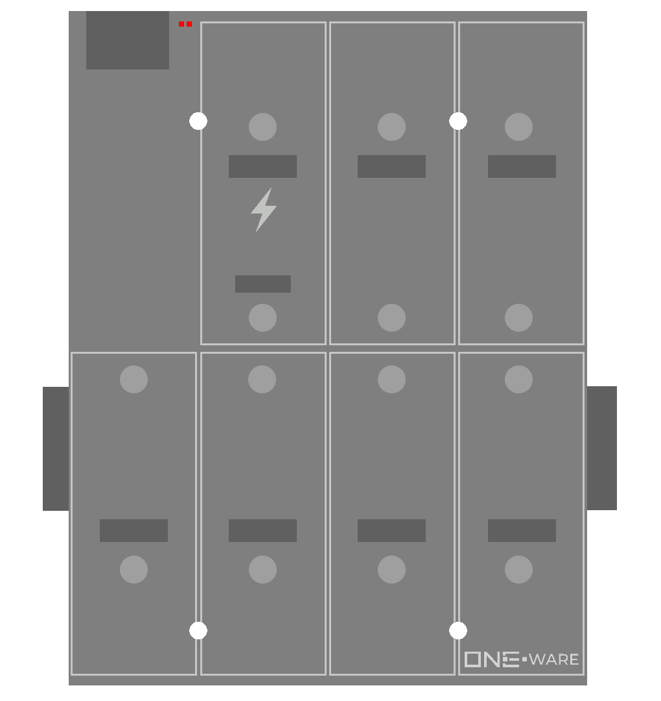

### Connectors:
- 1 Hyper-Speed CRUVI Slot (4 Gbps)
- 6-7 Full-Speed CRUVI Slots

### Features:
- 25k Logic Elements for high-speed control tasks.
- 1 Gbps ONE-BUS.
- 24V Input (8V-36V Tolerance).

### Applications:
- Control production facilities, robots, or drones.
- ONE-AI Integration for quality control, predictive maintenance, image processing, object detection, and more.
