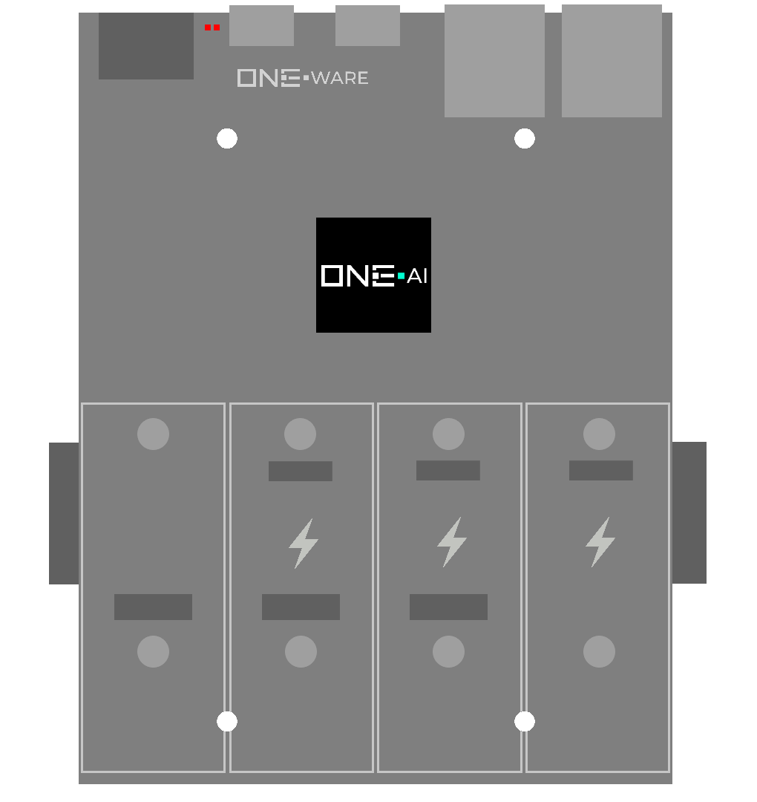

:::warning

This documentation is incomplete and will soon be improved!

:::

### Connectors:
-	3 Hyper-Speed CRUVI Slot (10 Gbps)
-	1-3 Full-Speed CRUVI Slots
-	1 USB 2.0 Device Type C 480Mb/s (with Programming Interface)
-	1 USB 3.1 Host/Device Type C 5Gb/s
-	2 Ethernet 2.5Gb/s (TSN)
-	2 M.2 Connectors for SSD or TPU

### Features: 
-	140k Logic Elements for high-speed control tasks
-	Embedded Linux Processor (Quad-Core ARM @ 1,5 GHz)
-	Up to 16 TOPs TPU
-	2 Gbps ONE-BUS
-	Program all connected Heads
-	24V Input (8V-36V Tolerance)

### Applications: 
-	Control production facilities, robots or drones
-	ONE-AI Integration for multiple high-speed AI applications in parallel for quality control, predictive maintenance, image processing, object detection and more

