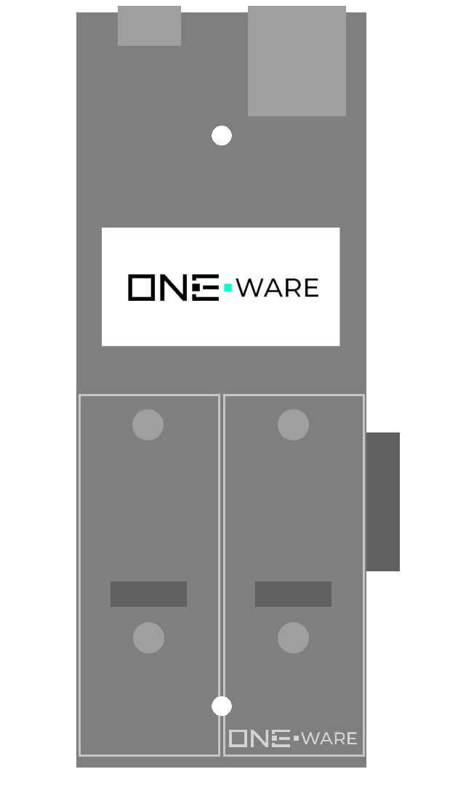

:::warning

This documentation is incomplete and will soon be improved!

:::

### Connectors:
-	2 SPI CRUVI Slots

### Features: 
-	Display for troubleshooting and live monitoring
-	300 Mbps ONE-BUS
-	Program all connected Heads
-	USB-C Connector for programming and debugging
-	Ethernet Connector for industrial communications or as programming and debugging interface
-	24V Input (8V-36V Tolerance)

### Applications: 
-	Program, monitor and control production facilities, robots or drones