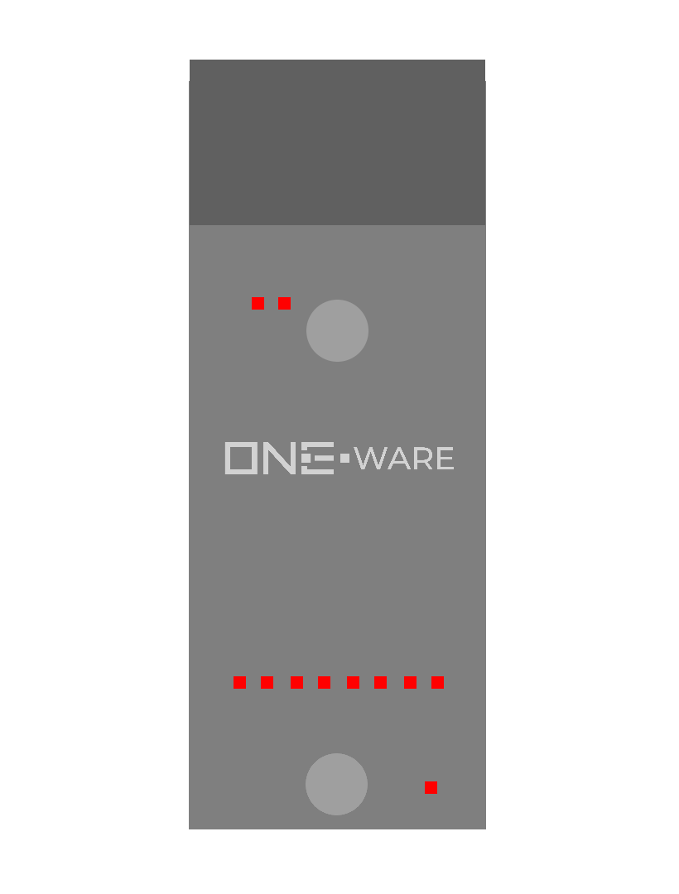

:::warning

This documentation is incomplete and will soon be improved!

:::

### Connectors:
-	SPI CRUVI Connector

### Features: 
-	8 protected 24V industrial digital inputs
-	High-Speed 1 MHz refresh rate 

### Applications: 
-	Digital input from input devices and sensors
-	Can replace dedicated components like phase sensors, because of the high refresh rate
