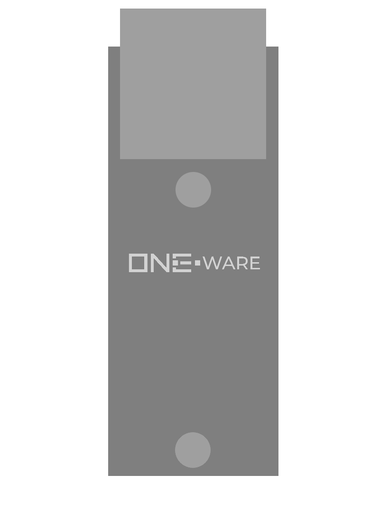

:::warning

This documentation is incomplete and will soon be improved!

:::

### Connectors:
-	SPI CRUVI Connector

### Features: 
-	100Mbps Ethernet Interface
-	Integrated TCP/UDP Controller

### Applications: 
-	Industrial communication with Profinet, Modbus, EtherCAT, EtherNet/IP and more
-	Monitoring and collecting data for AI training

