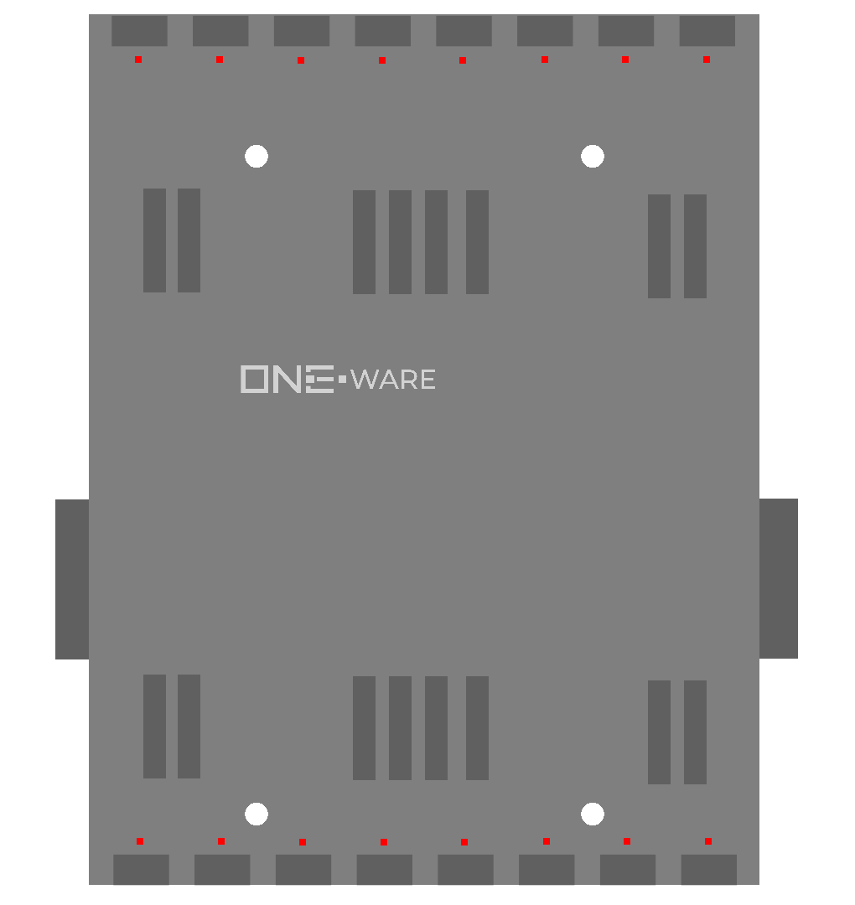

:::warning

This documentation is incomplete and will soon be improved!

:::

### Connectors:
-	SPI ONE-BUS

### Features: 
-	10 Mbps SPI ONE-BUS
-	16 Relay Outputs

### Applications: 
-	Control high-voltage and high-power devices

