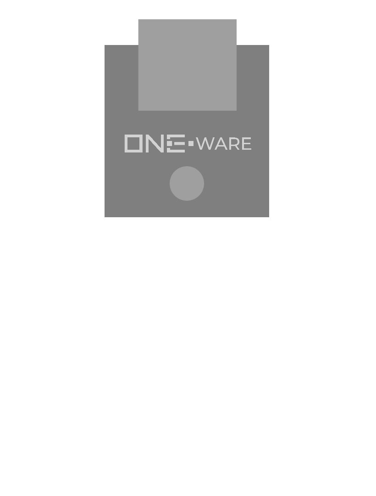

:::warning

This documentation is incomplete and will soon be improved!

:::

### Connectors:
-	SPI CRUVI Connector

### Features: 
-	SD Card Slot

### Applications: 
-	Collect data for ai training
-	Save error data e.g. for predictive maintenance

