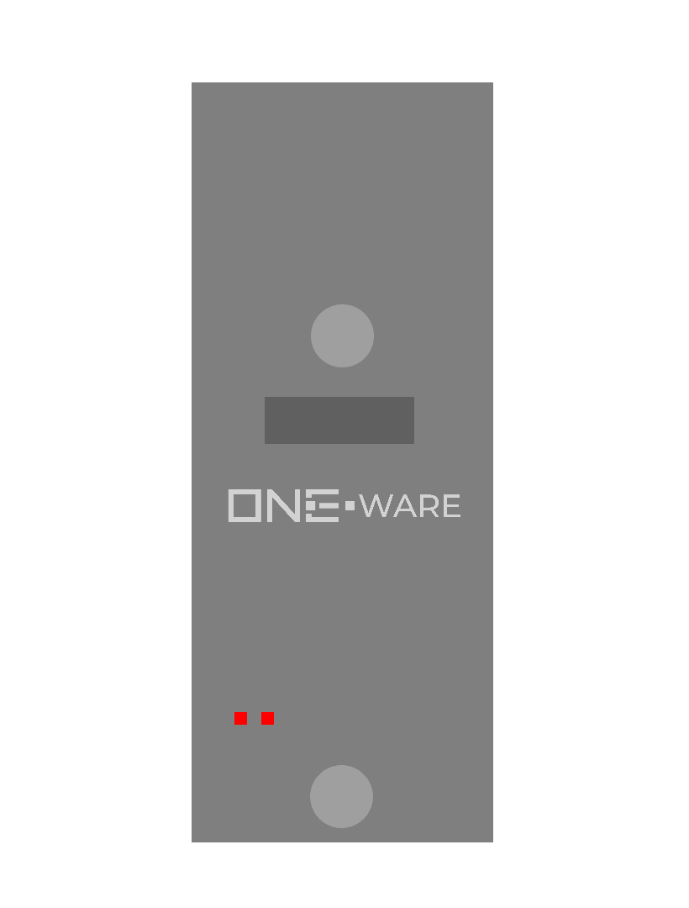

:::warning

This documentation is incomplete and will soon be improved!

:::

### Connectors:
-	Full-Speed CRUVI Slot
-	Full-Speed/SPI CRUVI Connector

### Features: 
-	Handle communication, so the Head can focus on high-speed control tasks
-	Control one full-speed CRUVI Component with the onboard connector
-	Control indirectly SPI CRUVI Components through the Head connection
-	Programmed directly with all Heads through the Control-module

### Applications: 
-	Profinet, Modbus, EtherCAT, EtherNet/IP and more with Ethernet Component
-	CANopen with CAN Component
-	IO-Link with IO-Link Component
-	Profibus or Modbus with RS485 Component
-	Help with low- and medium-speed operations
-	Use SPI CRUVI slots for full-speed CRUVI Components
