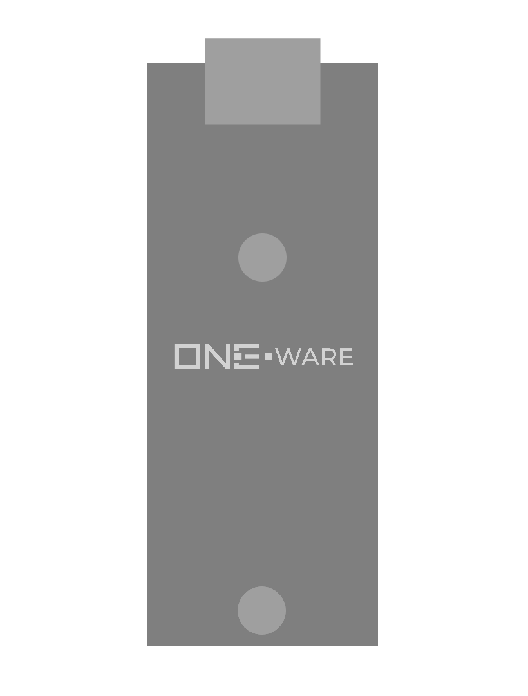

:::warning

This documentation is incomplete and will soon be improved!

:::

### Connectors:
-	Hyper-Speed CRUVI Connector

### Features: 
-	5Gbps USB 3.1 Device Interface

### Applications: 
-	Collecting data for AI training
-	Detailed High-Speed monitoring

