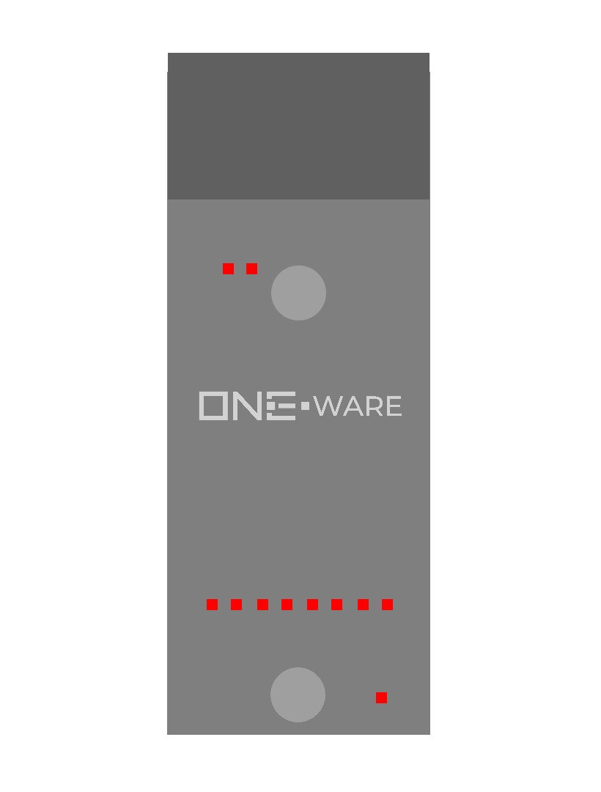

### Connectors:
- SPI CRUVI Connector

### Features:
- 8 protected 24V industrial digital inputs.
- High-Speed 1 MHz refresh rate.

### Applications:
- Digital input from input devices and sensors.
- Can replace dedicated components like phase sensors, due to the high refresh rate.
