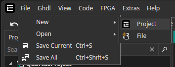
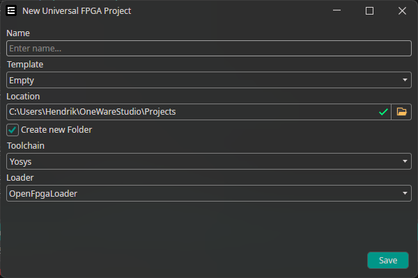

## Create a new Project

### Open new Project dialog

**Open the Project Creator by `File` -> `New` -> `Project`**

### Set Project options

You can change the following properties:

- **Name**: Project Name, should not contain any special characters and no spaces
- **Template**: Chose which files to generate for the new project
- **Location**: Project Location
- **Toolchain**: Toolchain to use for this project (Can be changed later)
- **Loader**: Loader to use for this project (Can be changed later)
