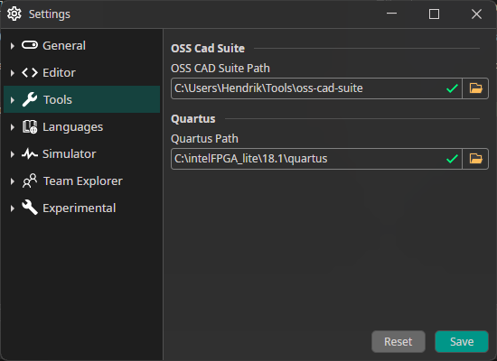

## What is OSS CAD Suite?

OSS CAD Suite is a binary software distribution for a number of open source software used in digital logic design. 
You will find tools for RTL synthesis, formal hardware verification, place & route, FPGA programming, and testing with support for HDLs like Verilog, Migen, and Amaranth.

An overview about all tools included can be found [here](https://github.com/YosysHQ/oss-cad-suite-build).

## Setup

### Download OSS CAD Suite

1. Download the latest Release of OSS CAD Suite Tools from [here](https://github.com/YosysHQ/oss-cad-suite-build/releases).

2. Extract the archive to a location of your choice (for Windows it is recommended that path does not contain spaces)
3. On macOS to allow execution of quarantined files `xattr -d com.apple.quarantine oss-cad-suite-darwin-x64-yyymmdd.tgz` on downloaded file, or run: ./activate in extracted location once.

### Setup OSS CAD Suite Path

If the path is correctly detected, the IDE will show a green tick ✅ next to the path.

## Next Steps

You should be able to use all the tools inside the IDE or from the integrated terminal.