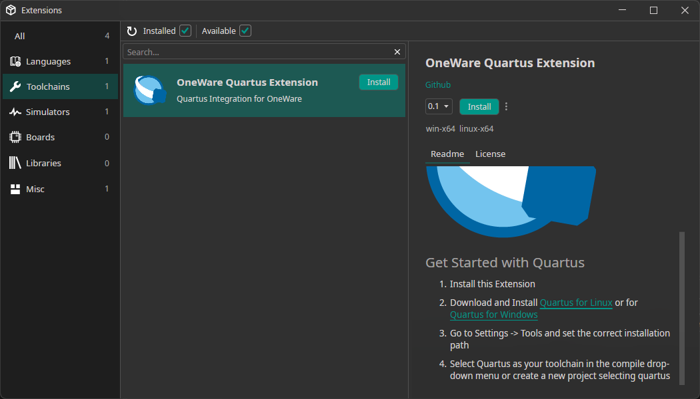
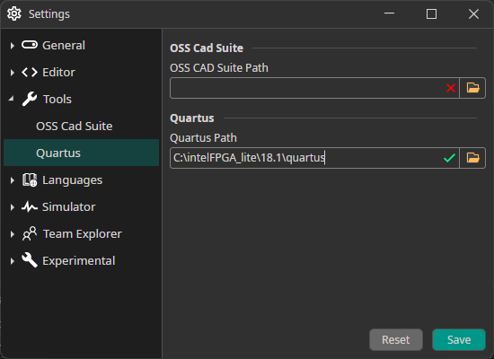
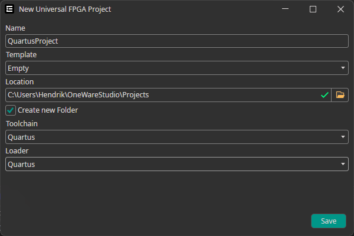
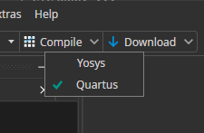

## What is Quartus?

Quartus is a software tool produced by Intel (formerly Altera) used for the development and programming of FPGA (Field-Programmable Gate Array) and CPLD (Complex Programmable Logic Device) devices.
It provides a comprehensive environment for system-on-a-programmable-chip (SOPC) design. 
Quartus includes everything needed to design, simulate, optimize, and program digital systems into Intel's line of FPGA and CPLD products.

## Setup

### Download Device support

Download the support for the hardware that you want to use:

| FPGA | Hardware | Download |
|---|---|---|
| Max 10        | Core Max10, Core Max10 Ultra, MAX1000, ... | <a href="https://download.altera.com/akdlm/software/acdsinst/18.1std/625/ib_installers/max10-18.1.0.625.qdz" target="_blank">MAX 10 device support</a> |
| Cyclone 10 LP | CYC1000, ...                               | <a href="https://download.altera.com/akdlm/software/acdsinst/18.1std/625/ib_installers/cyclone10lp-18.1.0.625.qdz" target="_blank">Cyclone 10 device support</a> |
| Cyclone V     | CYC5000, ...                               | <a href="https://download.altera.com/akdlm/software/acdsinst/18.1std/625/ib_installers/cyclonev-18.1.0.625.qdz" target="_blank">Cyclone 5 device support</a> |

### Download and Install Quartus

Download the installer for your platform and execute it.
The device support should be in the same folder as the installer, to install it automatically.

| Platform | Download |
|---|---|
| Windows | <a href="https://download.altera.com/akdlm/software/acdsinst/18.1std/625/ib_installers/QuartusLiteSetup-18.1.0.625-windows.exe" target="_blank">QuartusLiteSetup-18.1.0.625-windows.exe</a> |
| Linux   | <a href="https://download.altera.com/akdlm/software/acdsinst/18.1std/625/ib_installers/QuartusLiteSetup-18.1.0.625-linux.run" target="_blank">QuartusLiteSetup-18.1.0.625-linux.run</a> |
| MacOS   | **Unavailable** |

### Install OneWare Quartus Extension

### Setup Quartus Path

If the path is correctly detected, the IDE will show a green tick ✅ next to the path.

### Select Quartus Toolchain

Either select Quartus Toolchain and Loader while creating a project:

**Or** select Quartus in the Compile/Download Dropdown Menu:

## Next Steps

You should be able to use Quartus now to compile for your hardware!