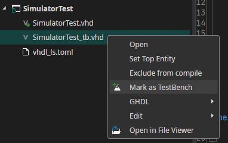
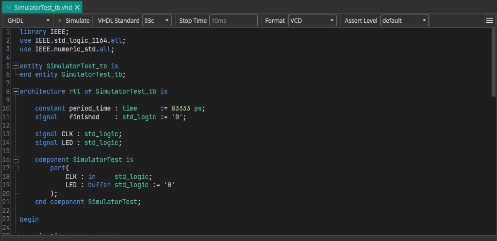

:::warning
This doc is incomplete and WIP!
:::

## Create Testbench

1. Create a Testbench. To see how a testbench can look like, create a project and select "VHDL Blink with Simulation" or "Verilog Blink with Simulation"
2. Make sure the testbench is marked  

## Install Simulator

Currently, IVerilog and GHDL are supported. 

To use IVerilog, simply [Setup OSS CAD Suite](/docs/studio/tutorials/setup-oss-cad-suite/).

To use GHDL, download the [GHDL Extension](https://github.com/one-ware/OneWare.GhdlExtension) from the package manager.

## Select Simulator

You can select the simulator to use with your testbench in the testbench toolbar:

There are many 