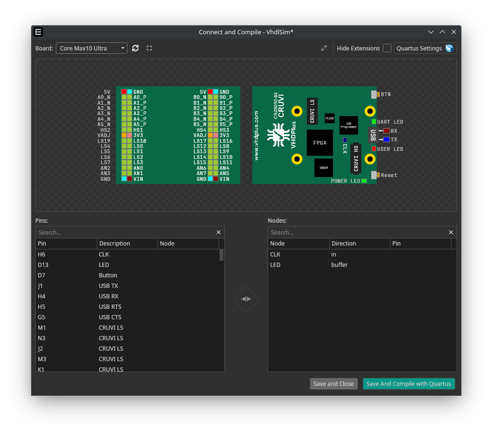
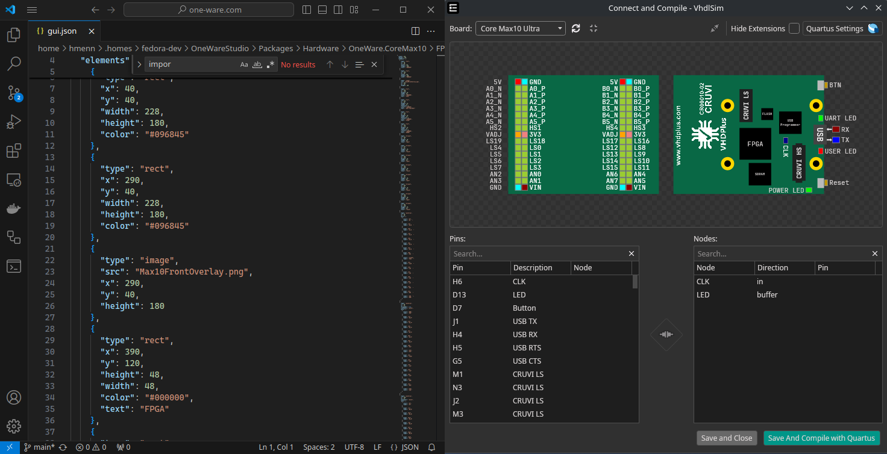

OneWare Studio features a system that allows you to add any FPGA Dev Board with json files.
This is useful for the GUI, and you will still need to make sure that your Toolchain supports your hardware.



## Directory Structure 

First, lets have a look at the OneWareStudio folder inside your home directory.

The directory structure looks similar to this:

```
OneWareStudio
├── Packages
│   ├── Hardware
│       ├── Local
|           ├── FPGA
|           ├── Extensions
|               ├── PMOD
|               ├── CRUVI_LS
|               ├── CRUVI_HS
│       ├── OneWare.MAX1000
|           ├── FPGA
|               ├── MAX1000
|                   ├── fpga.json
|                   ├── gui.json
...
```

`Local` is the package name that you can use to add your own Hardware, but its also **possible to create a new directory for your own Hardware Package**. This is useful if you want to sync your hardware integration with git. Just make sure that the paths inside your package match the same style as inside Local.

- FPGA Boards are located inside `Packages/Hardware/<PACKAGENAME>/FPGA/<YOUR FPGA BOARD NAME>`.
- Extension Boards are located inside `Packages/Hardware/<PACKAGENAME>/Extensions/<CONNECTOR>/<YOUR EXTENSION BOARD NAME>`

## Add an FPGA Board

1. Create a folder inside `OneWareStudio/Packages/Hardware/Local/FPGA/<YOUR BOARD NAME>`
2. Inside that folder, create a file called `fpga.json`

In that file you can add the pins of your board, the properties needed to compile for it and interfaces that are used for extensions or autoconnect.

To see how this file can look like when finished, you can have a look at the [fpga.json for the MAX1000](https://github.com/one-ware/OneWare.Max1000/blob/main/FPGA/MAX1000/fpga.json)

The basic file structure for the `fpga.json` looks like this.

```json
{
  "properties": {
    "quartusToolchainFamily": "MAX 10",
    ...
  },
  "pins": [
    {
      "description": "CLK",
      "name": "H6"
    },
    ...
  ],
  "interfaces": [
    {
      "name": "CLK",
      "pins": [
        {
          "name": "1",
          "pin": "35"
        }
      ]
    },
    ...
  ]
}
```

### Properties

Valid properties at the moment are for compiling using Yosys and/or Quartus.
These follow the documentation for the respective tools, and control how the arguments are set for running the commands needed to compile/program the hardware.

This is an example that is valid for the [Icebreaker V1.0](https://github.com/one-ware/OneWare.IceBreaker/blob/main/FPGA/iCEBreaker%20V1.0e/fpga.json) using [OSS CAD Suite](/docs/studio/tutorials/setup-oss-cad-suite/)

```json
"properties": {
    "yosysToolchainYosysSynthTool": "synth_ice40",
    "yosysToolchainYosysFlags": "",
    "yosysToolchainNextPnrTool": "nextpnr-ice40",
    "yosysToolchainNextPnrFlags": "--package sg48 --up5k",
    "yosysToolchainPackTool": "icepack",
    "yosysToolchainPackFlags": "",
    "openFpgaLoaderBoard": "ice40_generic",
    "openFpgaLoaderShortTermFlags": "",
    "openFpgaLoaderLongTermFlags": ""
  }
```

This is an example that is valid for the [MAX1000](https://github.com/one-ware/OneWare.Max1000/blob/main/FPGA/MAX1000/fpga.json) using [Quartus](/docs/studio/tutorials/setup-quartus/)

```json
 "properties": {
    "quartusToolchainFamily": "MAX 10",
    "quartusToolchainDevice": "10M08SAU169C8G",
    "quartusProgrammerShortTermMode": "JTAG",
    "quartusProgrammerShortTermOperation": "P",
    "quartusProgrammerLongTermMode": "JTAG",
    "quartusProgrammerLongTermFormat": "POF",
    "quartusProgrammerLongTermOperation": "P"
  }
```

### Pins

Pins are a simple array of json objects that look like this:

```json
{
  "description": "CLK",
  "name": "H6"
}
```

They simply set the pins that are available for your hardware, so you can connect them in the GUI.

### Interfaces

Interfaces can be used to graphically connect extensions for your hardware.

This is how you would define the PMOD Interface for the MAX1000:

```json
"interfaces": [
    {
      "name": "PMOD_1",
      "connector": "PMOD",
      "pins": [
        {
          "name": "1",
          "pin": "M3"
        },
        {
          "name": "2",
          "pin": "L3"
        },
        {
          "name": "3",
          "pin": "M2"
        },
        {
          "name": "4",
          "pin": "M1"
        },
        {
          "name": "5",
          "pin": "N3"
        },
        {
          "name": "6",
          "pin": "N2"
        },
        {
          "name": "7",
          "pin": "K2"
        },
        {
          "name": "8",
          "pin": "K1"
        }
      ]
    },
    ...
]
```

The `pin` value must point to a pin that is already defined in [Pins](#pins), while the `name` value provides the respective name that extensions can use to know where the real pin is located.

## Add an FPGA Extension

> Documentation coming soon!

## Add a GUI

Adding a GUI is similar for both FPGA Boards and Extensions.

Start by adding a `gui.json` file to your hardware folder (same location as `fpga.json`)

A `gui.json` file consists of `width`, `height` and an array of gui elements like this:

:::important
The width and height can be calculated by using the board size in mm and **multiplying it by 4**.
A board that is 100x100mm would have a size of 400x400px. It is recommended to use a border of 40px in each direction, so you would set the width and height as 480x480.
:::

:::tip
The IDE will show a live preview of your gui.json file!
Just open them next to each other, and view your changes on every save.

:::

```json
{
  "width": 480,
  "height": 480,
  "elements": [
    {
      "type": "rect",
      "x": 40,
      "y": 40,
      "width": 400,
      "height": 400,
      "color": "#096845"
    },
    ...
  ]
}
```


Here is a list of valid GUI Elements that can be added, including their possible attributes:

- The `textColor` will default to the IDEs default text color (white in darkmode / black in light mode). If you want to draw it ontop of rectangles, you should chose a color with good contrast.
- The `fontSize` will default to 10.

### Rect

Creates a Rectangle. This can be used as a background for the hardware.

| Property     | Description                  | Type   | Example             | Required |
| ------------ | ---------------------------- | ------ | ------------------- | -------- |
| x            | X coordinate in px           | double | 100                 | ✅       |
| y            | Y coordinate in px           | double | 100                 | ✅       |
| rotation     | Angle to rotate in degree    | double | 90                  |          |
| width        | Width in px                  | double | 100                 | ✅       |
| height       | Height in px                 | double | 100                 | ✅       |
| color        | Background color             | string | "#AA00BB"           | ✅       |
| cornerRadius | CornerRadius                 | string | "10 15 20 10"       |          |
| boxShadow    | shadow for the element       | string | "0 0 5 5 #77000000" |          |
| text         | Text to draw in the center   | string | "Test"              |          |
| textColor    | Text color as hex color code | string | "#FFFFFF"           |          |
| fontWeight   | Fontweight                   | string | "bold"              |          |
| fontSize     | Size for the text in pt      | int    | 10                  |          |


### Ellipse

Creates an ellipse.

| Property     | Description                  | Type   | Example             | Required |
| ------------ | ---------------------------- | ------ | ------------------- | -------- |
| x            | X coordinate in px           | double | 100                 | ✅       |
| y            | Y coordinate in px           | double | 100                 | ✅       |
| rotation     | Angle to rotate in degree    | double | 90                  |          |
| width        | Width in px                  | double | 100                 | ✅       |
| height       | Height in px                 | double | 100                 | ✅       |
| color        | Background color             | string | "#AA00BB"           | ✅       |

### Text

Creates a text. It is recommended to use the `label` property from Pin for labeling pins, or the `text` property from Rect for writing inside rects.

| Property     | Description                  | Type   | Example             | Required |
| ------------ | ---------------------------- | ------ | ------------------- | -------- |
| x            | X coordinate in px           | double | 100                 | ✅       |
| y            | Y coordinate in px           | double | 100                 | ✅       |
| rotation     | Angle to rotate in degree    | double | 90                  |          |
| color        | Background color             | string | "#AA00BB"           | ✅       |
| text         | Text to draw in the center   | string | "Test"              |          |
| textColor    | Text color as hex color code | string | "#FFFFFF"           |          |
| fontWeight   | Fontweight                   | string | "bold"              |          |
| fontSize     | Size for the text in pt      | int    | 10                  |          |

### Image

Creates a text. It is recommended to use the `label` property from Pin for labeling pins, or the `text` property from Rect for writing inside rects.

| Property     | Description                  | Type   | Example             | Required |
| ------------ | ---------------------------- | ------ | ------------------- | -------- |
| x            | X coordinate in px           | double | 100                 | ✅       |
| y            | Y coordinate in px           | double | 100                 | ✅       |
| rotation     | Angle to rotate in degree    | double | 90                  |          |
| width        | Width in px                  | double | 100                 |          |
| height       | Height in px                 | double | 100                 |          |
| src          | Relative path to image       | string | /Assets/overlay.png | ✅       |

### Pin

Creates an interactive Button, that can be used to graphically select a pin. The default width/height is 10px

| Property  | Description                        | Type    | Example   | Required |
| --------- | ---------------------------------- | ------- | --------- | -------- |
| x         | X coordinate in px                 | double  | 100       | ✅       |
| y         | Y coordinate in px                 | double  | 100       | ✅       |
| rotation  | Angle to rotate in degree          | double  | 90        |          |
| width     | Width in px                        | double  | 100       |          |
| height    | Height in px                       | double  | 100       |          |
| color     | Background color                   | string  | "#AA00BB" |          |
| bind      | Pin to connect                     | string  | "A4"      |          |
| label     | Text to draw next to the pin       | string  | "A4"      |          |
| flipLabel | Show label on right side           | boolean | true      |          |
| textColor | Label text color as hex color code | string  | "#FFFFFF" |          |
| fontSize  | Size for the label in pt           | int     | 10        |          |

### PinArray

Creates an array of Pins, which makes it easier for multiple pins next to each other

| Property   | Description                                | Type    | Example    | Required |
| ---------- | ------------------------------------------ | ------- | ---------- | -------- |
| x          | X coordinate in px                         | double  | 100        | ✅       |
| y          | Y coordinate in px                         | double  | 100        | ✅       |
| rotation   | Angle to rotate in degree                  | double  | 90         |          |
| pinWidth   | Default width for pins                     | double  | 10         |          |
| pinHeight  | Default height for pins                    | double  | 10         |          |
| horizontal | If the pinArray is horizontal              | boolean | true       |          |
| flipLabel  | Show label on right side                   | boolean | true       |          |
| color      | Default background for all pins            | string  | "#AA00BB"  |          |
| textColor  | Default label text color as hex color code | string  | "#FFFFFF"  |          |
| pins       | Included Pins                              | Pin[]   | View below | ✅       |


#### Example for an horizontal pinArray:

```json
{
  "type": "pinArray",
  "x": 80,
  "y": 168,
  "horizontal": true,
  "textColor": "white",
  "pins": [
    {
      "bind": "39",
      "label": "LED_R",
      "color": "red"
    },
    {
      "bind": "41",
      "label": "LED_B",
      "color": "blue"
    },
    {
      "color": "GND",
      "label": "GND"
    },
    {
      "color": "3V3",
      "label": "3V3"
    }
  ]
}
```

### PinBlock

Similar to PinArray, but requires a width. The Labels will be shown inside the Pins by default. 
The Pins will wrap once the width is reached, making this control useful to display blocks of pins.

| Property   | Description                                | Type    | Example    | Required |
| ---------- | ------------------------------------------ | ------- | ---------- | -------- |
| x          | X coordinate in px                         | double  | 100        | ✅       |
| y          | Y coordinate in px                         | double  | 100        | ✅       |
| width      | Max Width per row before wrapping          | double  | 100        | ✅       |
| rotation   | Angle to rotate in degree                  | double  | 90         |          |
| pinWidth   | Default width for pins                     | double  | 10         |          |
| height     | Default height for pins                    | double  | 10         |          |
| color      | Default background for all pins            | string  | "#AA00BB"  |          |
| textColor  | Default label text color as hex color code | string  | "#FFFFFF"  |          |
| pins       | Included Pins                              | Pin[]   | View below | ✅       |

#### Example for a pinBlock:

```json
{
  "type": "pinBlock",
  "x": 80,
  "y": 168,
  "width": 80,
  "pinWidth": 20,
  "pinHeight": 20,
  "pins": [
    {
      "bind": "39",
      "label": "LED_R",
      "color": "red"
    },
    {
      "bind": "41",
      "label": "LED_B",
      "color": "blue"
    },
    {
      "color": "GND",
      "label": "GND"
    },
    {
      "color": "3V3",
      "label": "3V3"
    }
  ]
}
```

### USB

Creates an usb control, that allows connecting RX and TX easily

| Property   | Description                                | Type    | Example    | Required |
| ---------- | ------------------------------------------ | ------- | ---------- | -------- |
| x          | X coordinate in px                         | double  | 100        | ✅       |
| y          | Y coordinate in px                         | double  | 100        | ✅       |
| rotation   | Angle to rotate in degree                  | double  | 90         |          |
| txBind     | Pin for TX                                 | string  | "B6"       |          |
| rxBind     | Pin for RX                                 | double  | "B6"       |          |
| flipLabel  | Show label on right side                   | boolean | true       |          |

### Gui

Shows another gui.json file as an element.

| Property   | Description                                | Type    | Example            | Required |
| ---------- | ------------------------------------------ | ------- | ------------------ | -------- |
| x          | X coordinate in px                         | double  | 100                | ✅       |
| y          | Y coordinate in px                         | double  | 100                | ✅       |
| rotation   | Angle to rotate in degree                  | double  | 90                 |          |
| src        | Relative path to gui.json                  | string  | ../B1/gui.json.png | ✅       |

### PMOD

Adds a PMOD Connector.

| Property       | Description                                | Type    | Example            | Required |
| -------------- | ------------------------------------------ | ------- | ------------------ | -------- |
| x              | X coordinate in px                         | double  | 100                | ✅       |
| y              | Y coordinate in px                         | double  | 100                | ✅       |
| rotation       | Angle to rotate in degree                  | double  | 90                 |          |
| bind           | PMOD Interface to connect                  | string  | "PMOD_1"           |          |
| connectorStyle | Adds an option to make connector smaller   | string  | "compact"          |          |

### CruviLS

Adds a CruviLS Connector.

| Property       | Description                                | Type    | Example            | Required |
| -------------- | ------------------------------------------ | ------- | ------------------ | -------- |
| x              | X coordinate in px                         | double  | 100                | ✅       |
| y              | Y coordinate in px                         | double  | 100                | ✅       |
| rotation       | Angle to rotate in degree                  | double  | 90                 |          |
| bind           | CruviLS Interface to connect               | string  | "CRUVI_LS_1"       |          |

### CruviHS

Adds a CruviHS Connector.

| Property       | Description                                | Type    | Example            | Required |
| -------------- | ------------------------------------------ | ------- | ------------------ | -------- |
| x              | X coordinate in px                         | double  | 100                | ✅       |
| y              | Y coordinate in px                         | double  | 100                | ✅       |
| rotation       | Angle to rotate in degree                  | double  | 90                 |          |
| bind           | CruviHS Interface to connect               | string  | "CRUVI_HS_1"       |          |

## Example Integrations

[Core MAX10](https://github.com/one-ware/OneWare.CoreMax10)

[IceBreaker](https://github.com/one-ware/OneWare.IceBreaker)

[MAX1000](https://github.com/one-ware/OneWare.Max1000)