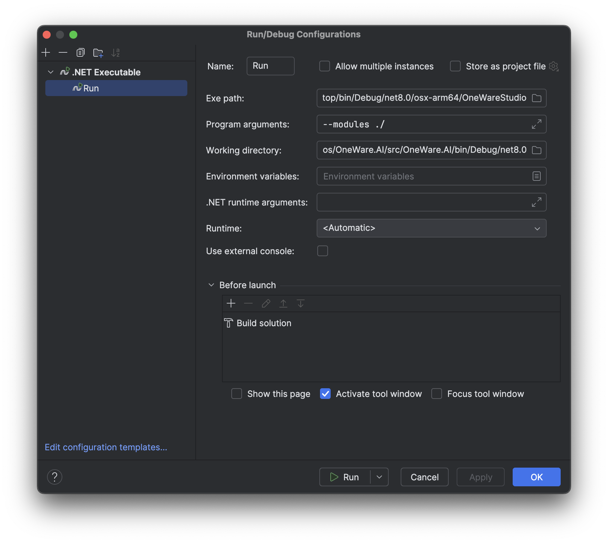

:::warning
Writing a plugin for OneWareStudio can be considered experimental, as not all the API is 100% done yet. 
Future updates can break your plugin. Documentation is incomplete and looking at the source code is nessesary. 
A good understanding of C# and Avalonia is recommended.
**If you just want to add your own hardware support, you can [do it without using C#](/docs/studio/plugins/add-hardware)**
:::

## Prerequisites

- .NET 9.0 SDK
- C# Code Editor (JetBrains Rider recommended)
- Latest Version of OneWare Studio

## Install the official templates (.NET 9)

```bash
dotnet new install OneWare.Templates
```

## Create a new Plugin

The following command can create an extension from a template for you.
You can replace OneWare.MyExtension with your Extension name. To make integration with github pipelines easier, you can add `-G YOUR_GITHUB_NAME` using your GitHub name.

```bash
dotnet new oneware.extension -o OneWare.MyExtension
```


## Run and Debug the Plugin

### Using Rider (recommended)

Open the created template .sln file with Rider.
Once fully loaded, you can create a new run configuration in the `edit Configurations` menu.
You can use add Configuration and add a new configuration with the **.NET Executable** type.



There you can set the path to your OneWareStudio Executable.
The Runtime arguments should be `--modules ./`, which means that you are pointing the module to be loaded to your working directory. For this to work, you finally need to set the working directory to your plugin folder and adding (`/bin/Debug/net9.0`) so that the working directory is the folder where your plugin gets compiled to.

If it works you can press on Run and should see that your plugin is loaded.
This also allows debugging your plugin directly in Rider.

### Using VSCode

> Coming soon!

## Plugin entry point

The entry point for your extension will be a module.cs, which derives from IModule.
In this file you can register types for dependency injection or add your own settings, toolchains, simulators, UI-Elements and much more.

```csharp
public class TestExtensionModule : IModule
{       
    public void RegisterTypes(IContainerRegistry containerRegistry)
    {
        //Register types for dependency injection
    }

    public void OnInitialized(IContainerProvider containerProvider)
    {
        //Register settings, toolchains, Add UI Elements ...
    }
}
```

## Dependency management


Inside the .csproj file of your plugin you can see the added nuget packages:

Here you can see that OneWare Dependencies that are included in the IDE anyways are market with `Private="false" ExcludeAssets="runtime;Native"`, so ensure that these dependencies are not copied to the plugin archive. They still need to be added to make compilation work.

```xml
...
 <ItemGroup>
    <PackageReference Include="OneWare.Essentials" Version="0.9.0" Private="false" ExcludeAssets="runtime;Native" />
    <PackageReference Include="OneWare.Settings" Version="0.30.3" Private="false" ExcludeAssets="runtime;Native" />
    <PackageReference Include="OxyPlot.Avalonia" Version="2.1.0-Avalonia11" Private="true" />
    <PackageReference Include="SkiaImageView.Avalonia11" Version="1.5.0" Private="true" />
 </ItemGroup>
...
```

## API Documentation

The API is not ready yet, same goes for the documention. 
If you still want to experiment with OneWareStudio Plugins, it is recommended to look at the [source code of OneWare Studio](https://github.com/one-ware/OneWare) or see other official examples:

- [OneWare Quartus Extension](https://github.com/one-ware/OneWare.Quartus)
- [OneWare GHDL Extension](https://github.com/one-ware/OneWare.GhdlExtension)
- [OneWare NetlistSVG Extension](https://github.com/one-ware/OneWare.NetlistSVG)
