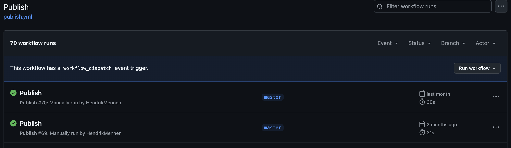
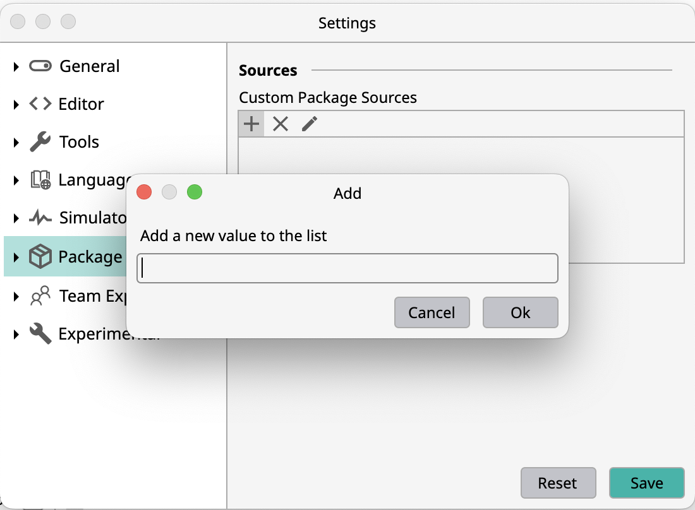

## The oneware-extension.json file

The oneware-extension.json is the manifest for the extension, and will be needed to show the plugin inside the package manager.

```json
{
  "category": "Tools",
  "type": "Plugin",
  "name": "Test Plugin",
  "id": "TestModule",
  "description": "Test Plugin Description",
  "license": "MIT",
  "iconUrl": "https://raw.githubusercontent.com/Author/TestPlugin/main/Icon.png",
  "tabs": [
    {
      "title": "Readme",
      "contentUrl": "https://raw.githubusercontent.com/Author/TestPlugin/main/Extension.md"
    },
    {
      "title": "License",
      "contentUrl": "https://raw.githubusercontent.com/Author/TestPlugin/main/License.md"
    }
  ],
  "links": [
    {
      "name": "Github",
      "url": "https://github.com/Author/TestPlugin"
    }
  ],
  "versions": [
    {
      "version": "0.1",
      "targets": [
        {
          "target": "all",
          "url": "https://github.com/Author/TestPlugin/releases/download/0.1/TestPluginExtension_0.1_all.zip"
        }
      ]
    }
  ]
}
```

## Platform specific targets:

If your plugin contains platform specific code or assets, you can also publish it in different versions for each platform. 
In most cases osx-x64 can also be used by osx-arm64 (with performance degradation).

```json
    {
      "target": "linux-x64",
      "url": "https://github.com/Author/TestPlugin/releases/download/0.1/TestPluginExtension_0.1_linux-x64.zip"
    },
    {
      "target": "osx-x64",
      "url": "https://github.com/Author/TestPlugin/releases/download/0.1/TestPluginExtension_0.1_osx-x64.zip"
    },
    {
      "target": "osx-arm64",
      "url": "https://github.com/Author/TestPlugin/releases/download/0.1/TestPluginExtension_0.1_osx-arm64.zip"
    }
```

## Run Release Pipeline

The template contains a release pipeline that you can use to create a github release.



After running it sucessfully it will create a Release in /releases of your github repository automatically.

## Try out plugin

You can add a link to your uploaded oneware-extension.json source in the settings.



The link should be the raw json file like that (https://raw.githubusercontent.com/one-ware/OneWare.GhdlExtension/refs/heads/master/oneware-extension.json)

After refreshing your published plugin should be available in the package manager.

## Submit to Package Manager

If you want your Plugin to be visible for everyone, you can open a Pull Request [here](https://github.com/one-ware/OneWare.PublicPackages)